# EC2 云主机的使用与运维

## 0.目的

- 了解 EC2服务
- 掌握使用控制台获取EC2实例信息的方法(看页面的说)
- 掌握使用控制台创建EC2实例的方法(AMI:Amazon Machine Image)
- 掌握使用控制台管理EC2实例的方法(安全性, 联网, 计算, 存储和数据库)

## 1.计算服务概览

### 1.1 Lambda

### 1.2 EC2

### 1.3 ECS

### 1.4 AWS Elastic Beanstalk

### 1.5 AWS Fargate

### 1.6 Amazon ECR

(Amazon Elastic Container Registry)

### 1.7 Amazon EKS(动态监控(跟州长一样))

(Amazon Elastic Kubernetes Service)

## 2.Amazon EC2

### 2.1AMI

### 2.2实例类型

### 2.3网络设置

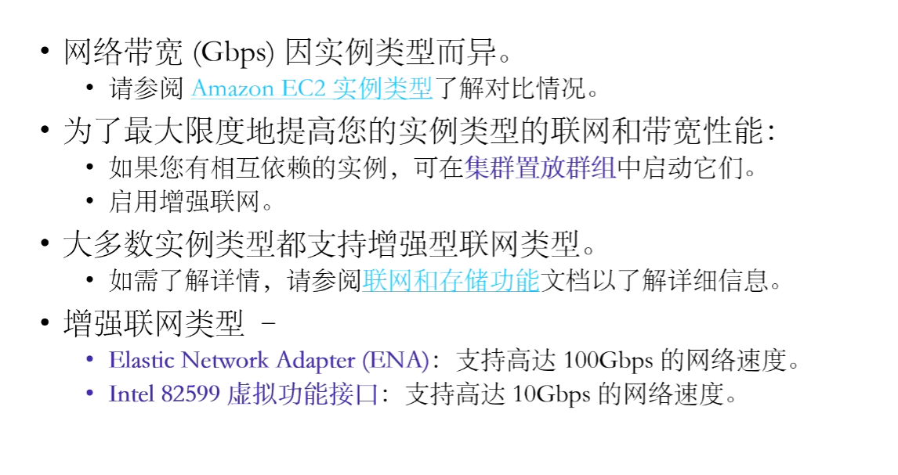

**局域网**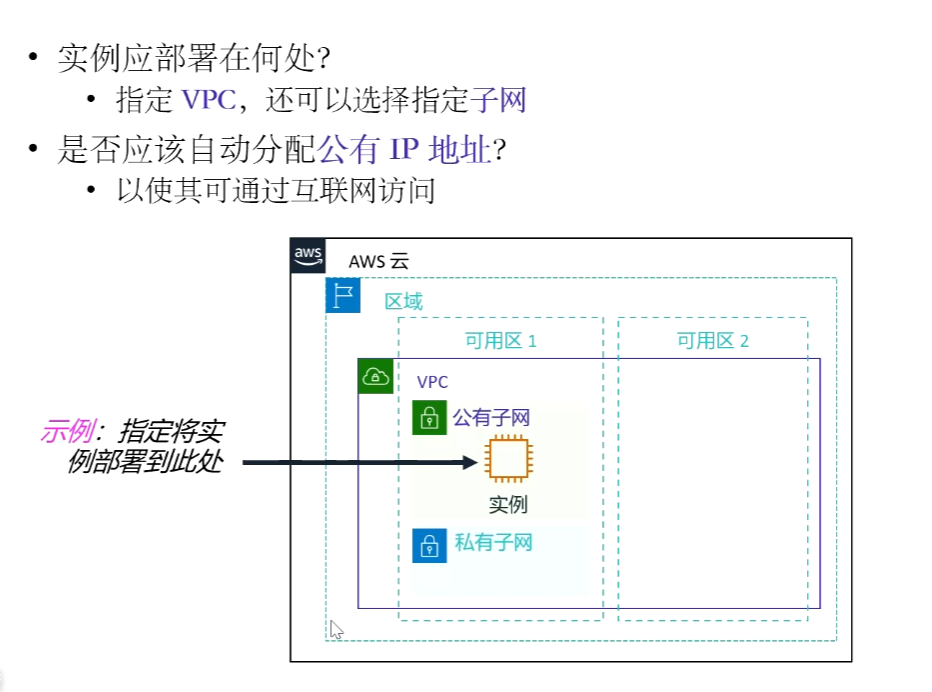 

### 2.4IAM角色

实例要访问私有子网的权限,要通过IAM给

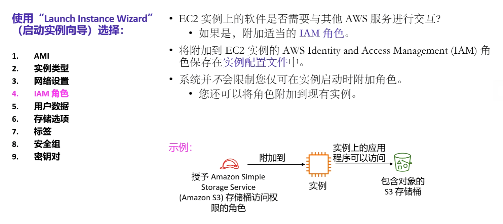

### 2.5用户数据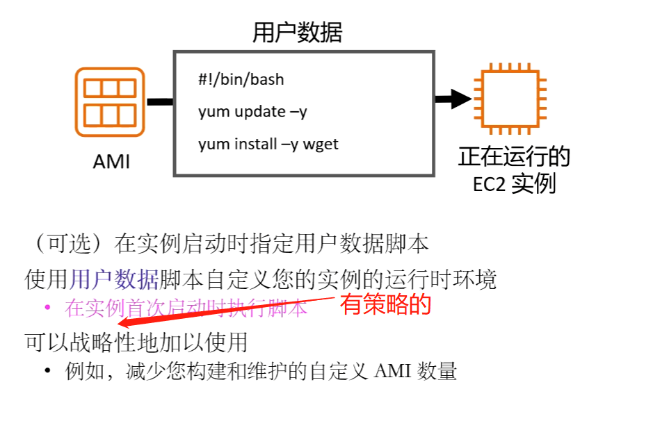

### 2.6存储选项

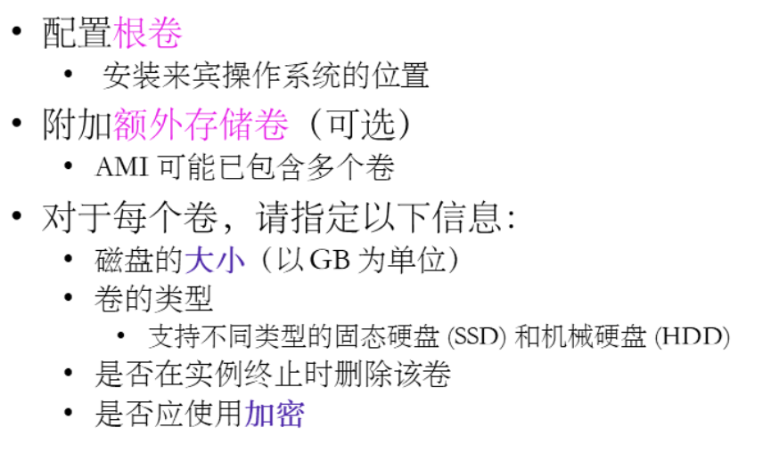

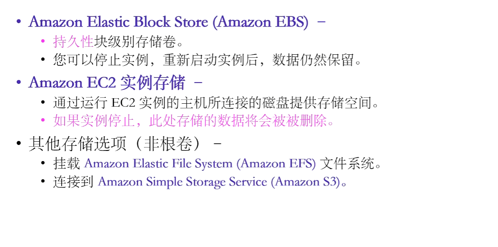

#### 存储选项示例

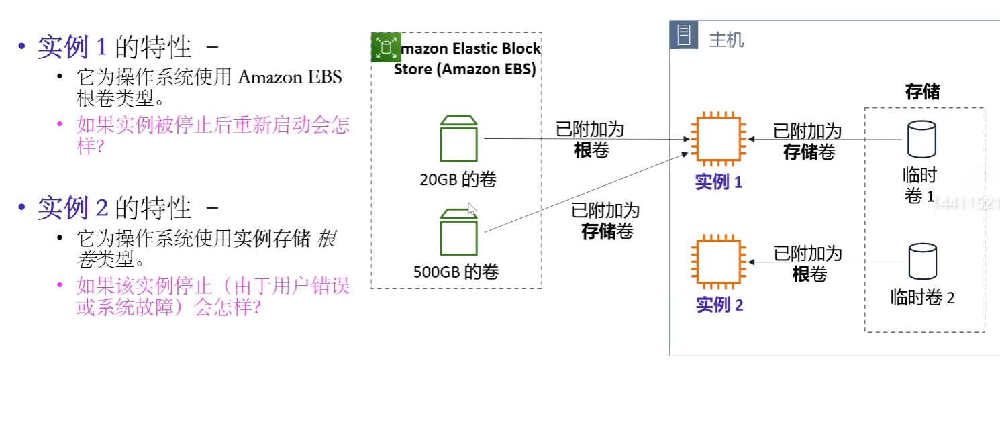

### 2.7标签

#### 添加标签

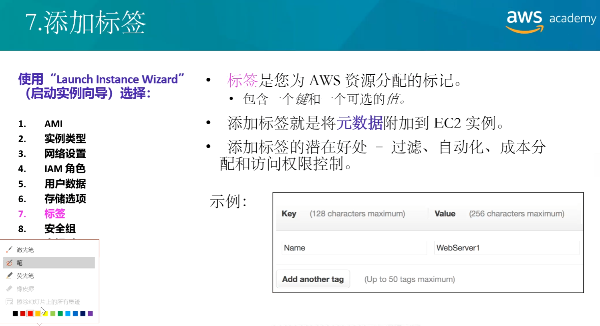

### 2.8安全组

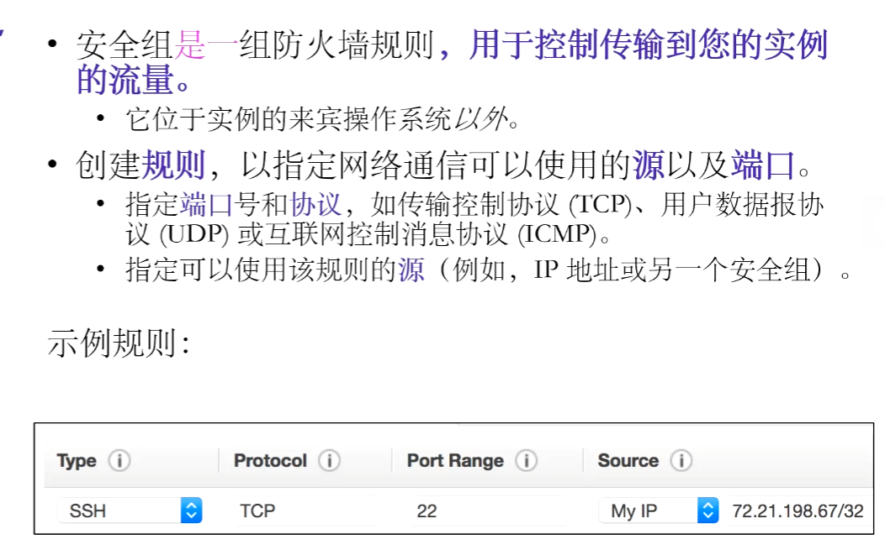

### 2.9密钥对

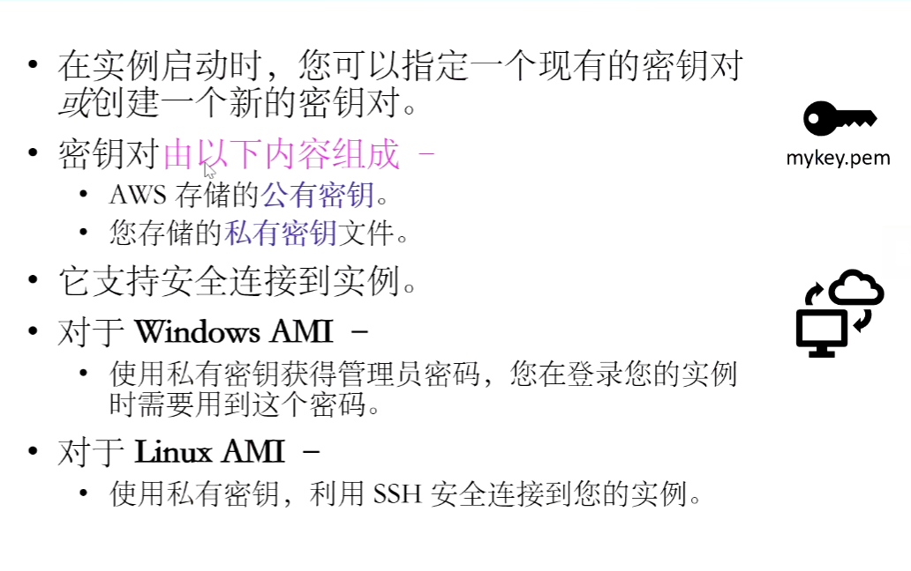

### 2.10生命周期

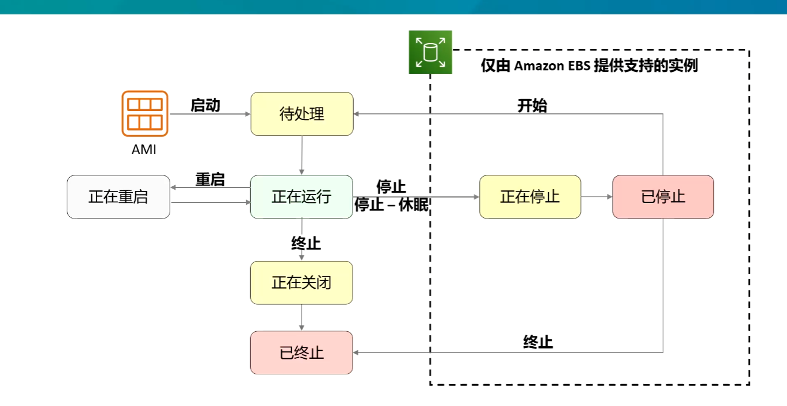

### 2.11 实例休眠选项

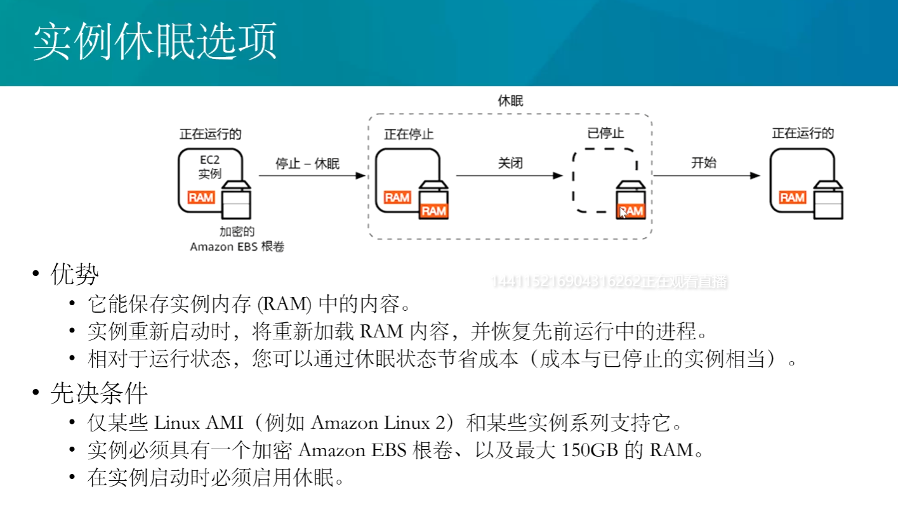

### 2.12 考虑使用弹性IP

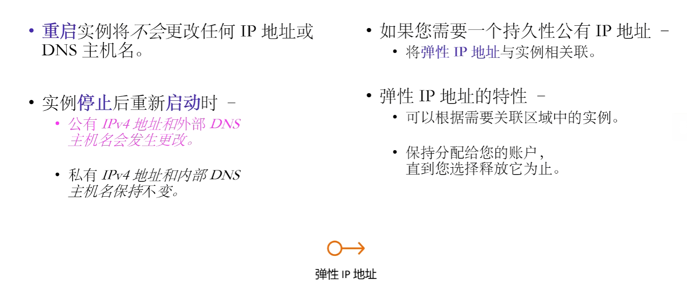

### 2.13 实例元数据

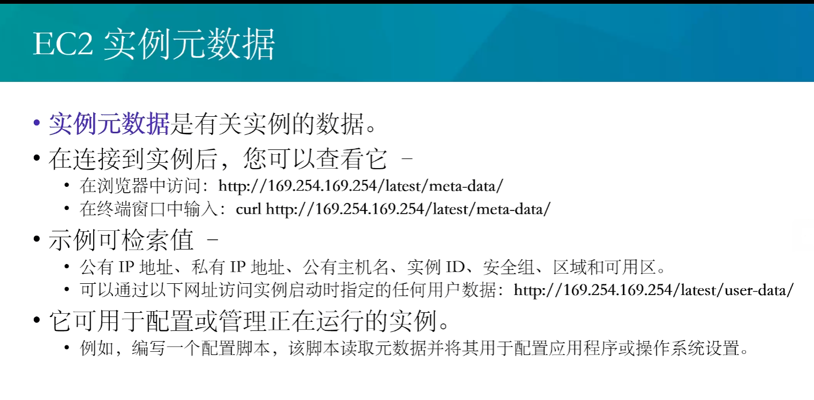

### 2.14 Amazon CloudWatch 用于监控

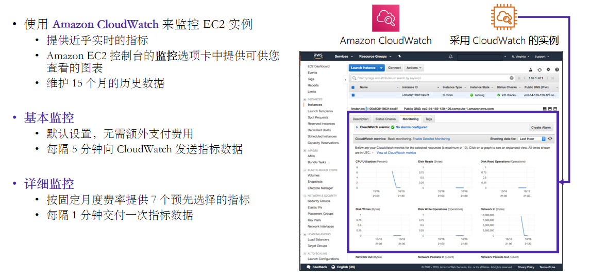

## 3.Amazon EC2成本优化

### 3.1 定价模型

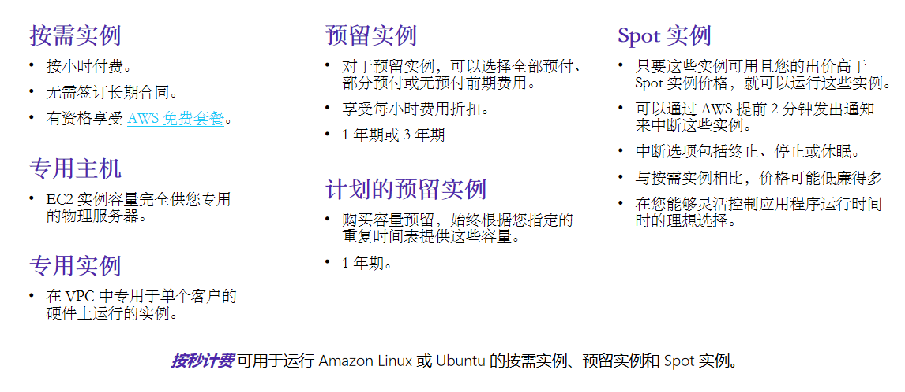

### 3.2 定价模型:优势

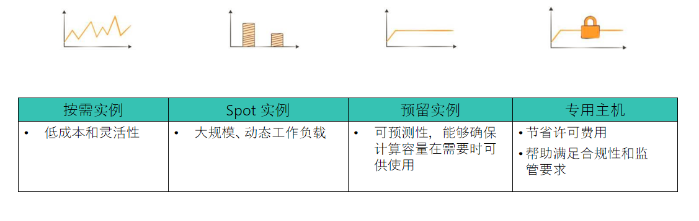

### 3.3 定价模型:使用案例

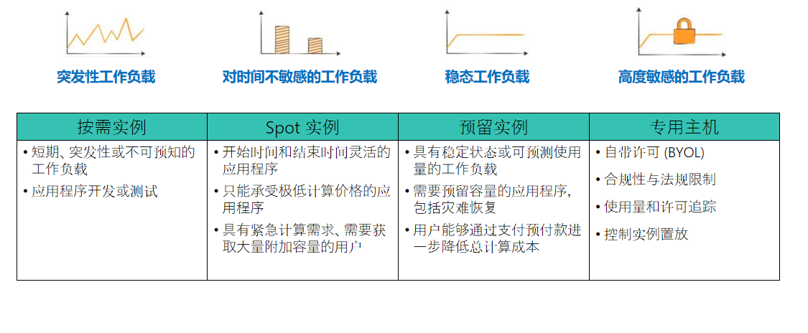

### 3.4 成本优化的四大支柱

#### 3.4.1 支柱1: 合理调整大小

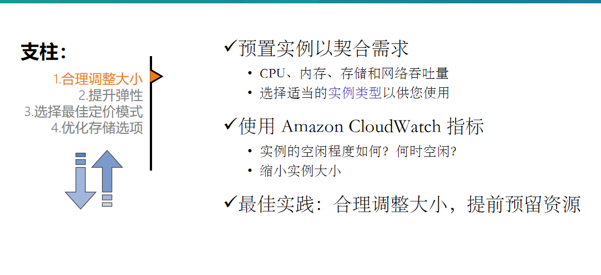

#### 3.4.2 支柱2: 提升弹性

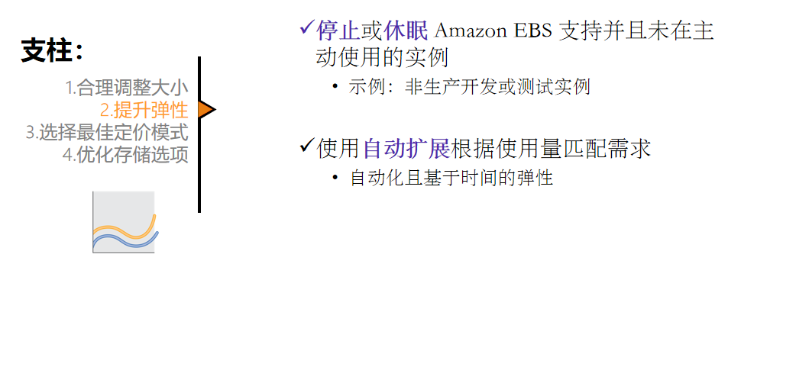

#### 3.4.3 支柱3: 选择最佳定价模式

#### 3.4.4 支柱4: 优化存储选项

### 3.5 衡量,监控和改善

### 3.6 总结

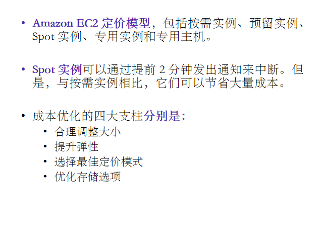

## 4.模块总结

