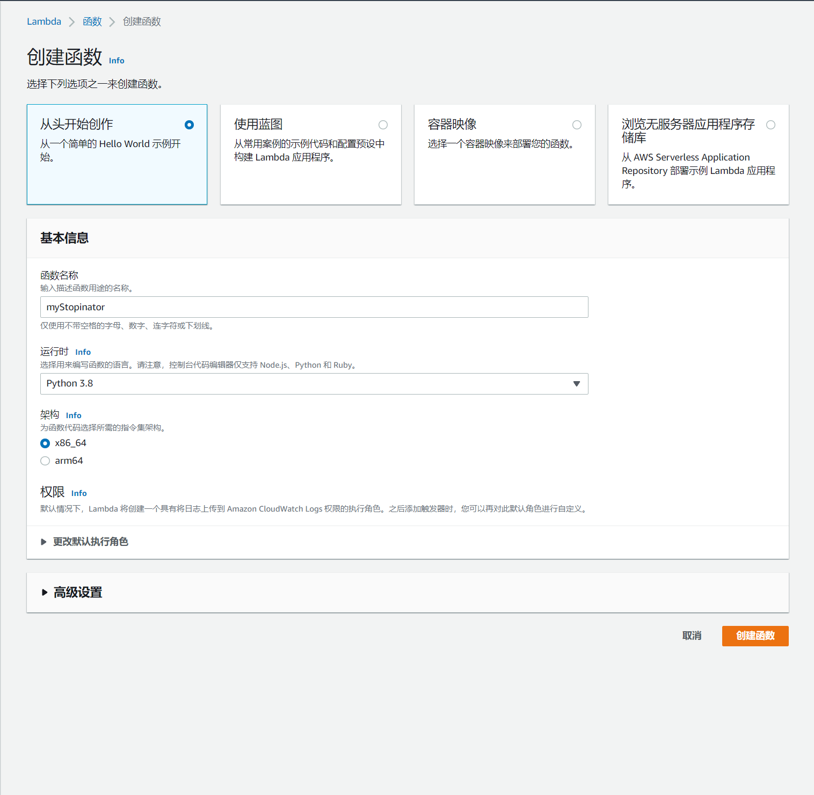
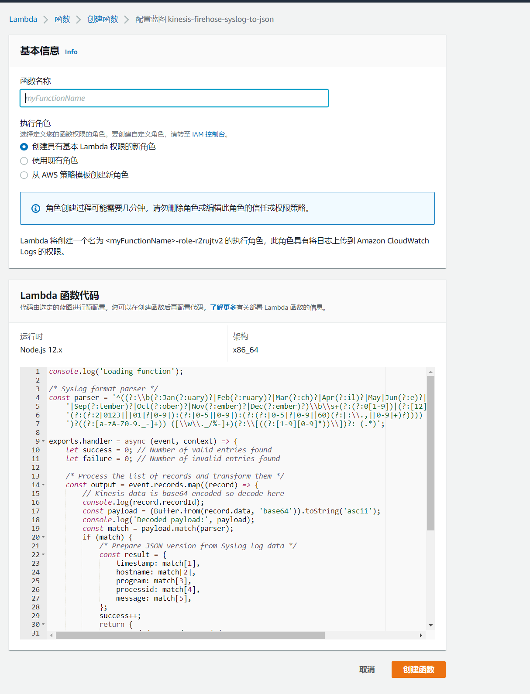
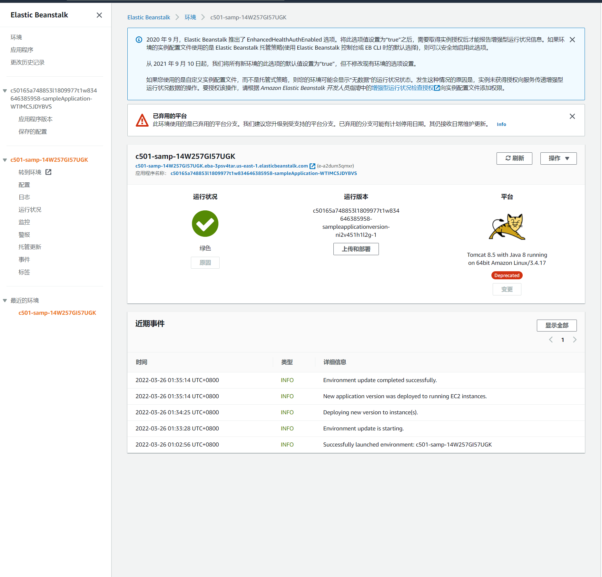

# lambda与Beanstalk初体验

## lambda

### 1.创建函数,(具体讲一下蓝图,浏览器~)

2. ### 从代码运行到结果的流程说一下lambda

蓝图(权限..全不用配,指定角色,代码都帮你写好)

容器镜像(抄别人作业)

lambda 在实现个人自定义数据类型时,如何实现?

lambda跟直接写代码然后运行的Beanstalk区别就在于亚马逊在这提供了更多函数吗? 那我自己写了函数不也能卖.

什么情况下用lambda,什么情况下用Beanstalk?

Beanstalk,适合 前后端代码都写完,直接迁移用,需要主机(ec2)(全贯通,只需上传项目完成代码...)

lambda 适合自己写函数, aws中账户只有存储资源, 计算资源只能是lambda(按毫秒收费),控制执行策略,保证够用. lambda完成了后端对数据库,服务器(tomcat)的操作,通过lambda,前端照样可以获得其想获得的数据.

## Beanstalk

牵扯实例,Beanstalk本身不收钱,因为他只是对aws资源的整合,不提供资源.

牵扯实例,80出端口是开的,

自动伸缩也包含涉及实例

