## 操作系统的地位和目标(分类角度)

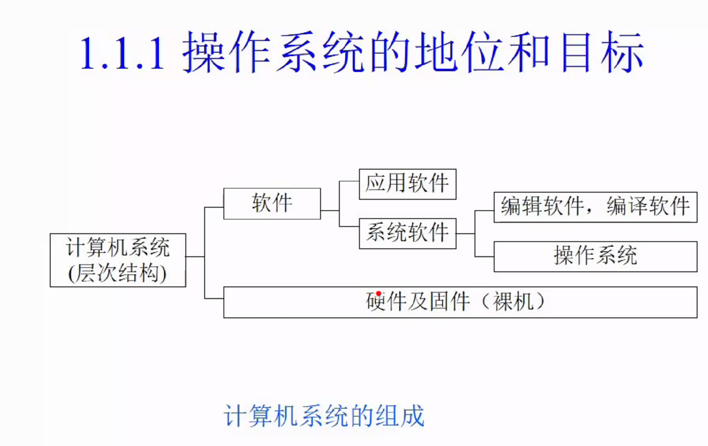

## 操作系统地位, 各个开发人员面对对象(工作方面)

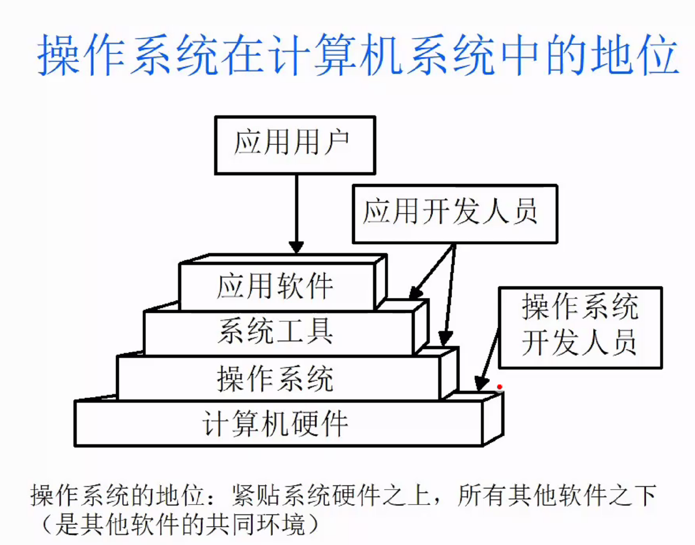

## 引入操作系统目标

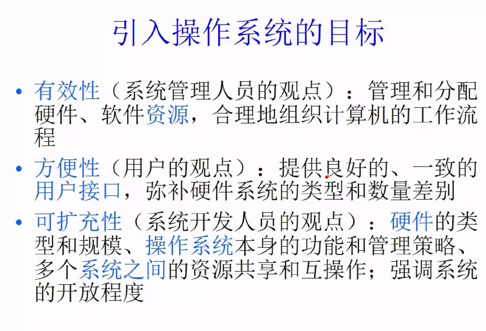

## 通道和中断技术

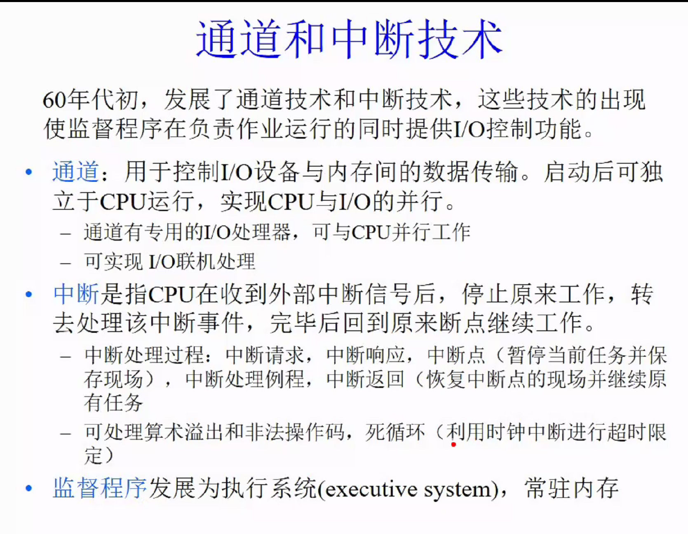

## 多道批处理系统(并行机制,一个cpu核上)

对应单道处理系统,作业粗略理解为人物

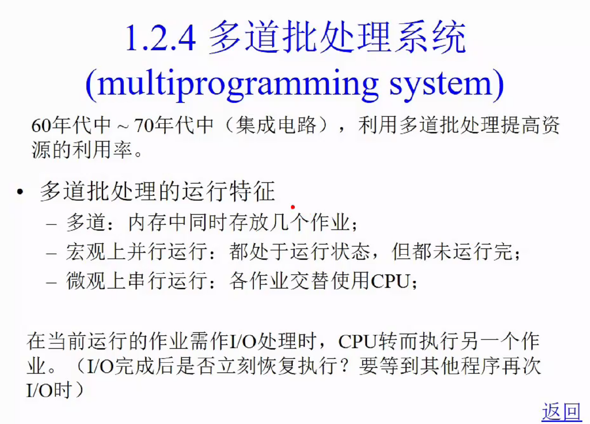

提交0提交给内存/cpu(进医院排队),完成(走了)

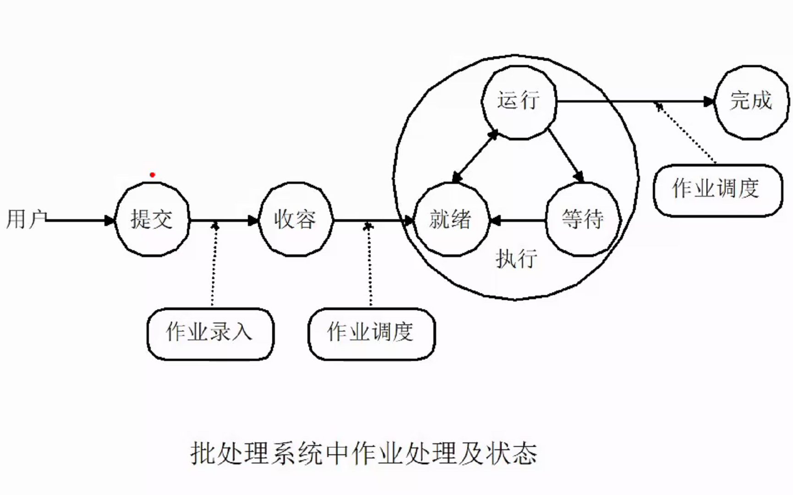

#### 单道,多道批处理的比较(疫情检测,检测点多与1)

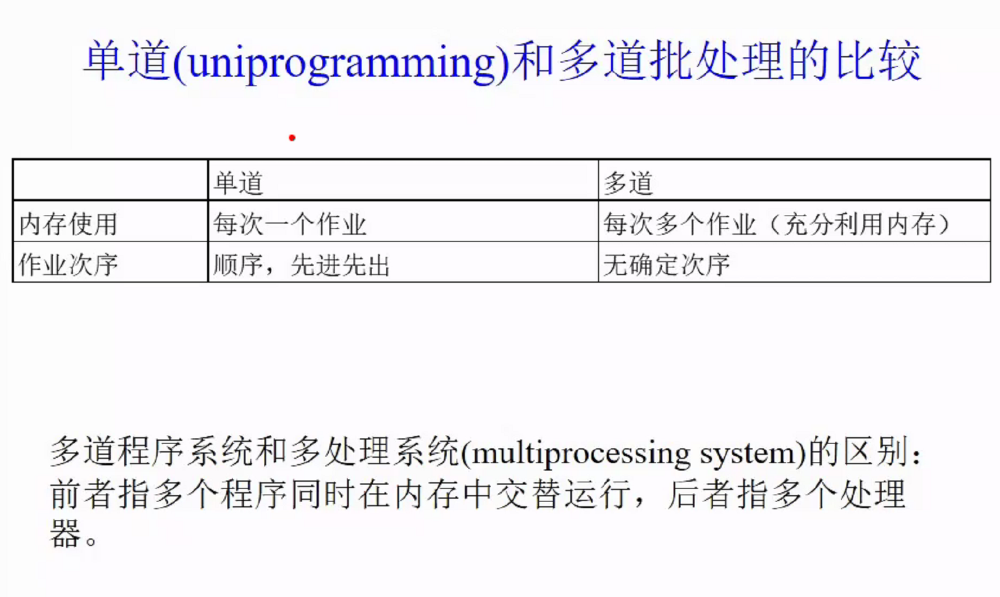

#### 多道批处理系统上的技术

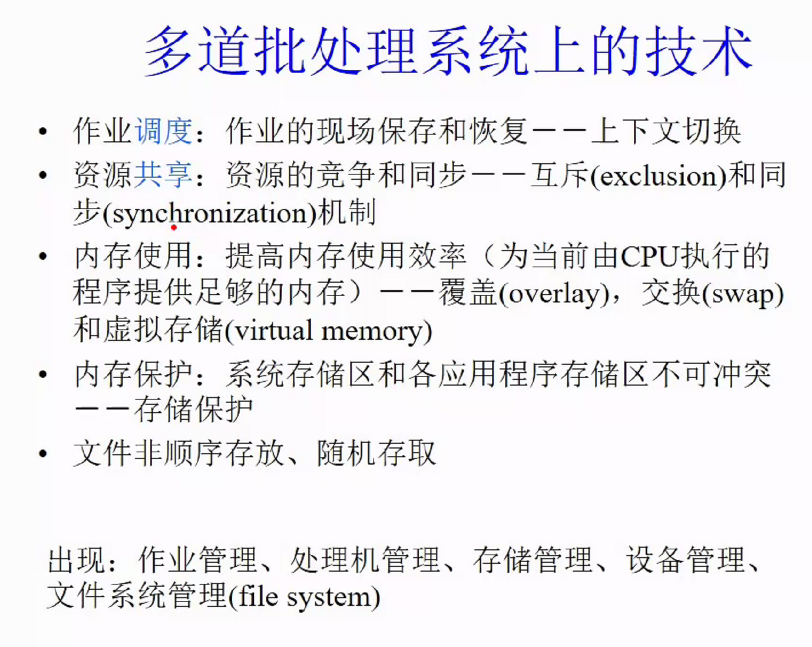

- 作业调度(上下文切换): 上下个任务切换(作业的现场保存与恢复)
- 资源共享(互斥和同步机制): 资源的竞争和同步(两个人都提交代码,最后两个都提交成功)
- 内存使用: 
- 内存保护: 
- 文件非顺序存放,随机存取.

出现(体现): 作业管理, 处理机管理, 存储管理, 设备管理,文件系统管理

## 分时操作系统

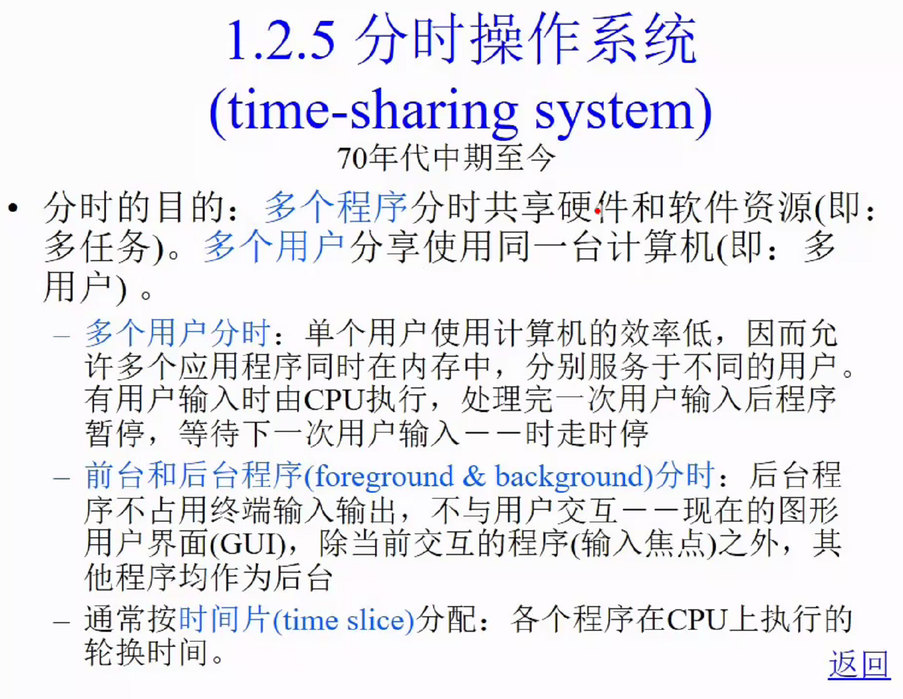

## 抢先式和非抢先式

分时的定义:上课,一段时间各个课程一起上.

非抢先式: 上课中途自己退出(任务本身)

抢先式:老师中途走了(非任务本身)

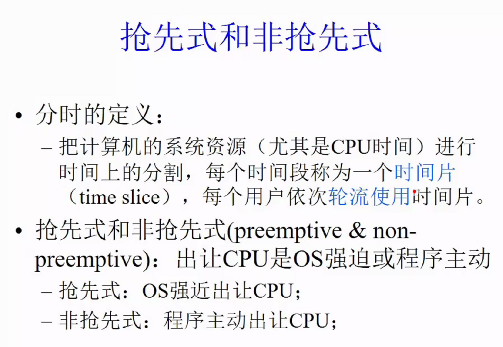

分析系统主要问题

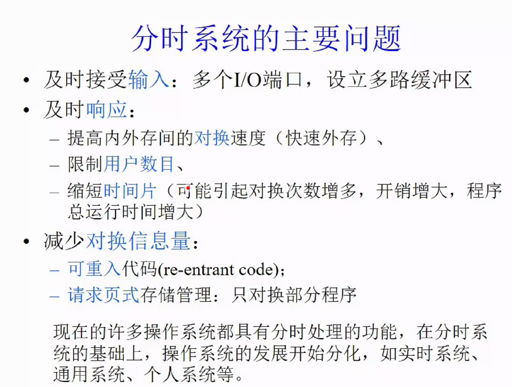

## 实时操作系统+多处理机操作系统

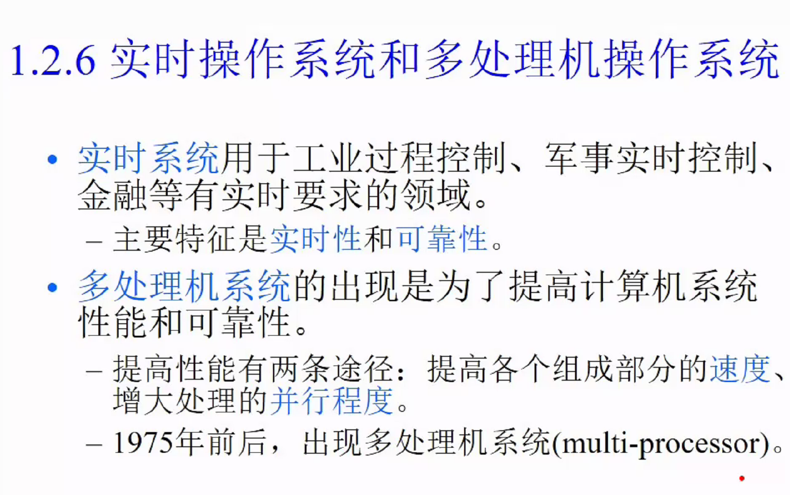