操作系统仅仅考虑 任务执行过程中使用资源

cpu,内存 磁盘

程序的集合,操作系统

cpu调度器(调用资源,的程序)

物理内存管理()

虚拟内存管理

并发与并行

- 并发: 在一**段**时间内,多个程序运行
- 并行:一个时间**点**上,多个程序运行

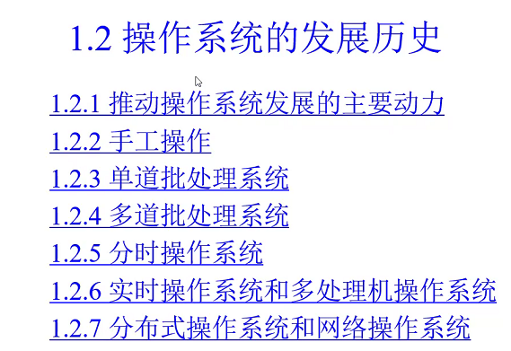

OS Kernel特征:

- 并发
  - 需要OS管理和调度
- 共享
  - **"同时**"访问
  - 互斥共享(打印机不可以同时用,保证都能写上?)
- 虚拟
  - 多道程序设计技术,程序在特定单条道上,独立运行.(文件不知道存在那个扇区上)
  - 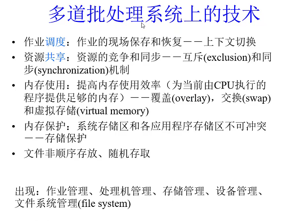
- 异步
  - 程序的执行不是一贯到底,而是走走停停,向前推进速度不可预知
  - 只要运行环境相同,OS需要保证运行的结果也相同

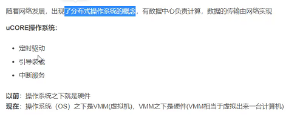

通道和中断技术

- 通道:	控制I/O设备与内存间的数据传输
- 中断:CPU在收到外部中断信号后,停止原来工作,转去处理该中断事件
- 监督程序: 发展为执行系统, 常驻内存.
  - 作核酸,从进入入口,到最后做核酸, 那个队多长(缓存空间多大), 监控机制,说缓存(队列)放进多少人.(有人监控着什么时候放行,放多少行,)

单道批处理问题

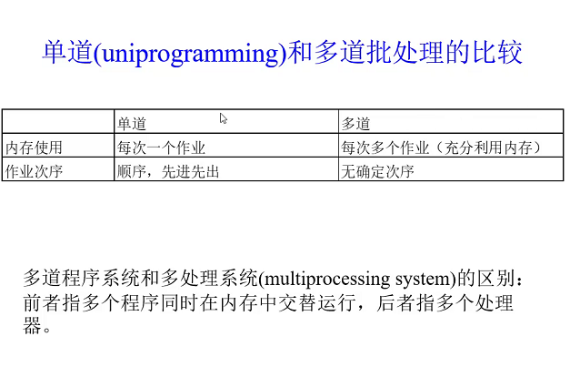

多道批处理

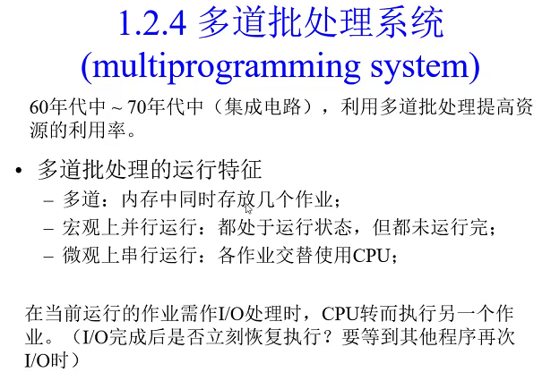

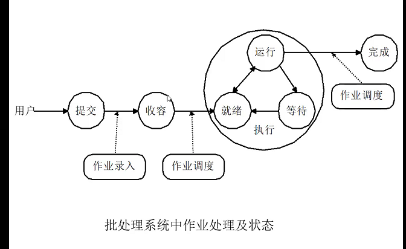

# 第二章:作业管理和用户接口

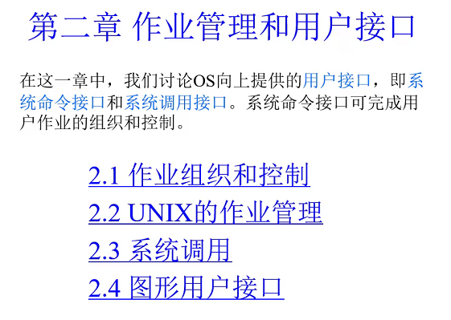

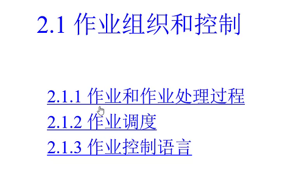

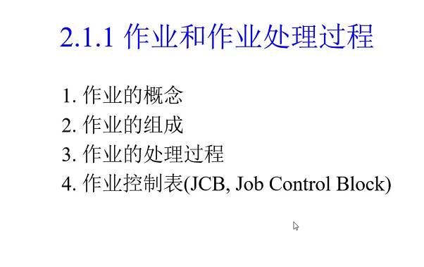

## 作业组织和控制

### 作业和作业处理过程

#### 作业的概念(滴滴大车就是任务,)

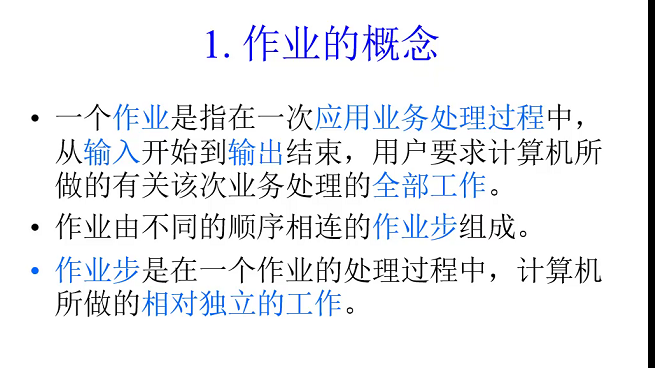

#### 作业的组成

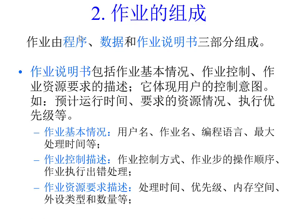

#### 作业处理过程

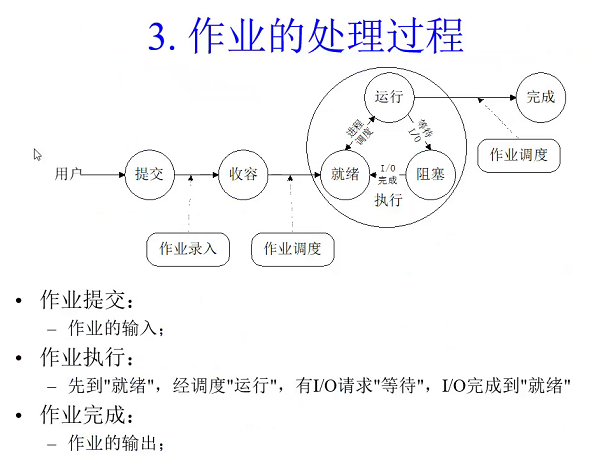

#### 作业控制表

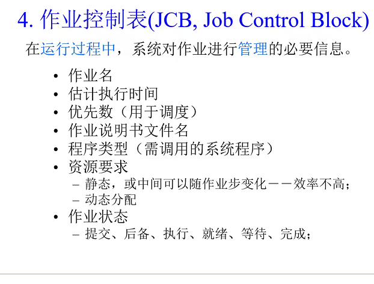

### 作业调度

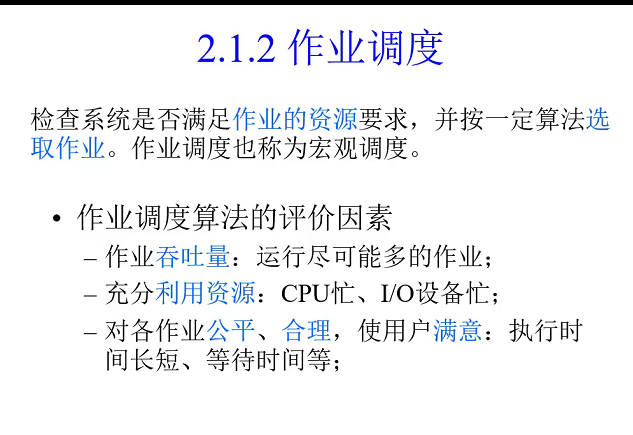

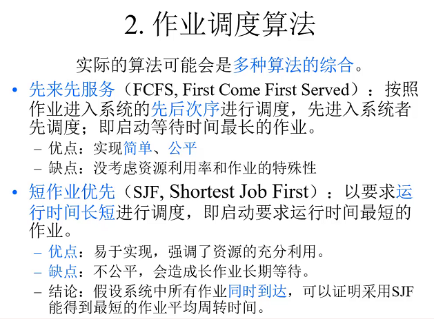

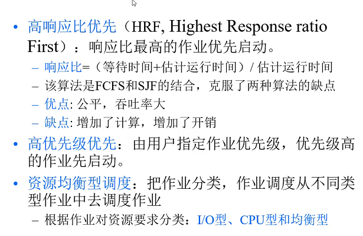

### 作业控制语言

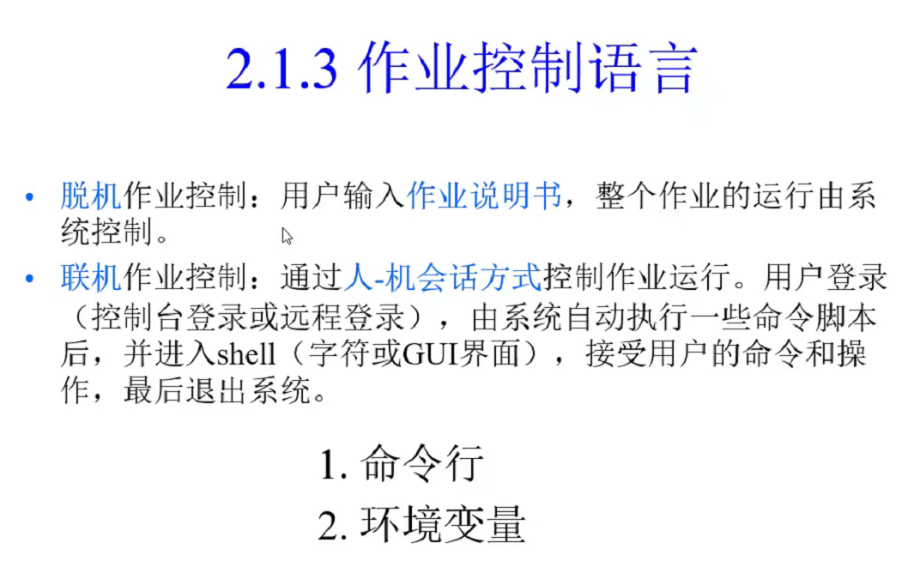

脚本: .bat(指令有序集)

讲究语法(java规则)就是程序了(指令有序集)

命令分类:

- 内部命令:直接由shell本身完成(不论用不用,都加载),功能简单,基础
- 外部命令:可执行文件,功能复杂,不用操作系统不加载,
  - 自动批处理,自动加载(auto)所指定内容,任何路径都可使用.

## Unix的作业管理

## 系统调用

## 图形用户接口