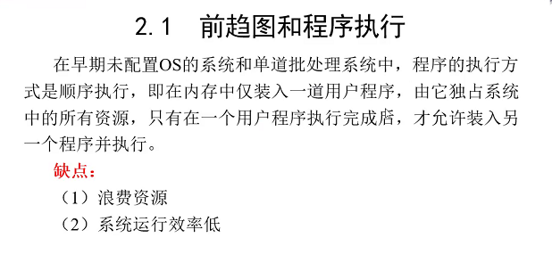
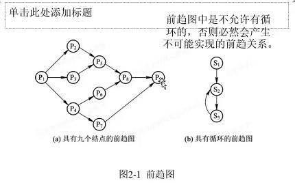
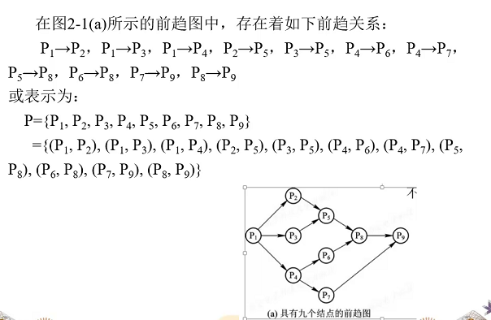
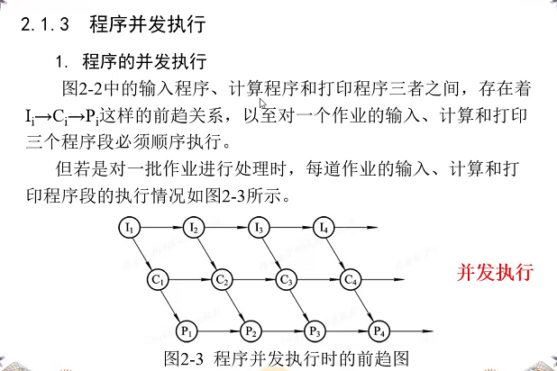
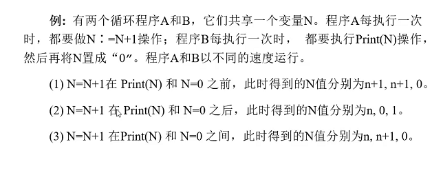
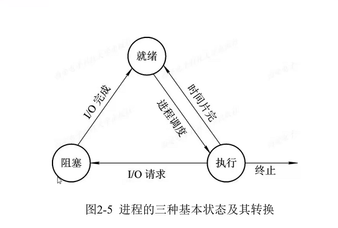
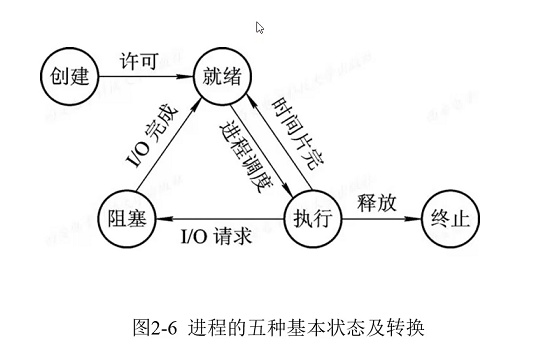

# 进程的描述与控制

## 2.1 前趋图和程序执行

- 直接前趋: 
- 直接后继: 
- 重量(权重): 执行时间

### 1. 前趋图

(每个点表示一个程序)

- 为什么前趋关系不可循环(规避,循环的话要有个头)?

  - 造成资源浪费,无法跳出来,死循环

- 前趋关系表示

  

### 2. 程序执行

1. 顺序执行(吃饭: 点单后,等上菜,再吃,前一步没做完,后一步做不了)

   1. 特征:
      1. 顺序性
      2. 封闭性: 程序运行时,独占全集资源,资源的状态只有本程序可改变
      3. 可再现性: 只要程序执行时的环境和初始条件相同,就可再现

2. 并发执行(并发≠并行)

   

   1. 间断性

      

   2. 失去封闭性

      

   3. 不可再现性(n=0,n=n+1执行顺序不同造成结果不同)

      ​	

​		

3. 执行哪种程序执行方式,取决于(那一批作业执行关系)任务的类型.

## 2.2 进程的描述

#### 进程的定义:

一个程序,调用内存执行该程序时,他就是一个进程.

程序参与并发执行后独立运行(程序变成进程),在操作系统中必须为之配置一个专门的数据结构, 进程控制块(Process Control Block)->内存空间.指针

#### 进程的特征

1) 动态性: 进程是临时的,有生命周期(从创建到终止)
2) 并发性: 进程是系统进行资源分配和调度的一个独立单位
3) 独立性: 多个进程可在处理机上交替执行
4) 异步性: 系统为每个进程建立一个进程控制块(食堂吃饭,每个人吃饭时间不一样,有人快,有人慢.)

#### 进程的三种基本状态

- 阻塞: 塞车

- 就绪: 红绿灯, 等绿灯

- 运行: 在走了, 在走了

  

  进程的初始/终止状态(三种基本状态+创建状态+终止状态)

  

  1. 创建状态
     步骤：
     （1）申请一个空白PCB，并向PCB中填写控制和管理信息；
     （2）为该进程分配运行时所必须的资源；
     （3）最后，把该进程转入就绪状态并插入就绪队列之中。

     

     但如果进程所需的资源尚不能得到满足，比如系统尚无足够
     的内存使进程无法装入其中，此时创建工作尚未完成，进程不能
     被调度运行，于是把此时进程所处的状态称为
     创建状态。

     

  2) 终止状态
     进程的终止也要通过两个步骤：
     （1）首先，是等待操作系统进行善后处理。
     （2）最后将其PCB清零，并将PCB空间返还系统。

     

     当一个进程到达了自然结束点，或是出现了无法克服的错误，
     或是被操作系统所终结，或是被其他有终止权的进程所终结，
     将进入终止状态。

## 2.3 进程控制

## 2.4 进程同步

## 2.5 经典进程的同步问题

## 2.6 进程通信(程序并发执行的图)

## 2.7 线程(Threads)的基本概念

## 2.8 线程的实现

## 习题

