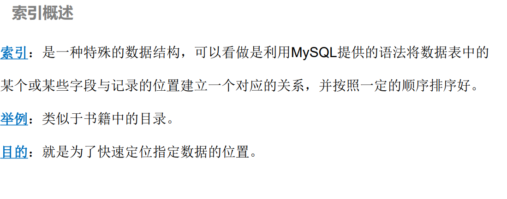
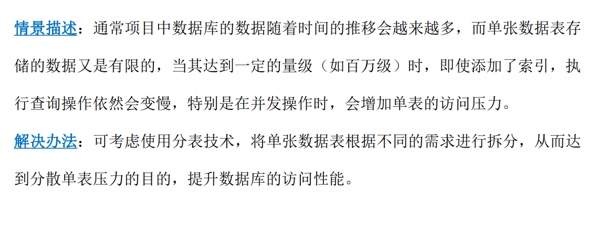
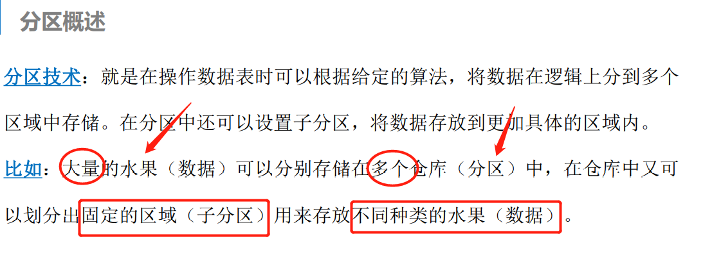
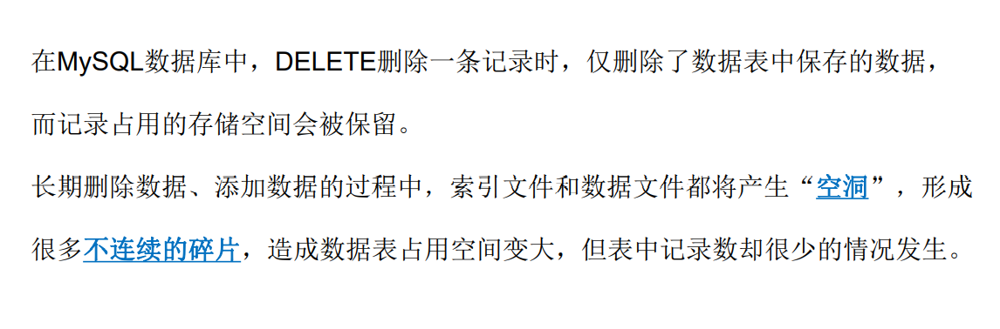

# 数据库优化(重点,整章都是重点)

## 1.存储引擎(在于教会选择合适的引擎)

### 1.什么是存储引擎(作用,具体实现)

### 2.存储引擎的选择

### 3.InnoDB存储引擎

### 4.MyISAM存储引擎

## 2.索引

### 1.索引概述

### 2.索引的基本操作

### 3.索引的使用规则

## 3.锁机制

**(用户a,b都查找stock值,在b查找过程中,a改了stock值,但并未提交,此时B的stock为原值(500),a的为300,在同一时间下,两个用户得到不同的结果,这是需要避免的)**

### 1.认识锁机制(what is)

### 2.表级锁

### 3.行级锁

## 4.分表技术

## 5.分区技术

#### 为什么要分区

#### 如何分区

### 1.分区概述

### 2.分区管理

## 6.数据碎片与维护

文书工作很多,记录很多,真正干活的没几个

## 7.动手实践: 数据库优化实战

