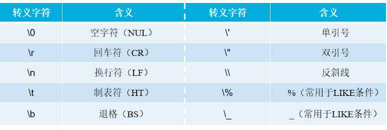

# 数据类型与约束

## 0.目的

- 掌握常用的数据类型的使用
- 掌握常用约束的使用
- 掌握字符集的设置与处理

## 1.数据类型

### 1.数字类型

- 整数类型

- 浮点数类型

- 定点数类型

- BIT类型

- 无符号数据类型

  - INT 有符号
  - INT UNSIGNED 无符号INT类型

- 显示宽度(2进制转10进制位数,符号位+1)

  - 

- 零填充设置(ZEROFILL)

  

#### 整体概述

### 浮点类型

### 定点类型(带小数点推荐设置)

### BIT(位)类型

### 直接常量

#### 数字

##### 十进制:

- ##### 123

- 1E2

##### 十六进制

- x'41'
- 0x41

##### 二进制

- b'1000001'

#### 字符串

- 定界符
  - 'abc'
  - "abc"
- 转义字符
  - "\"转义,转换"\"后面关键字的原本含义
  - 

### 布尔值

TRUE转换为1

FALSE转换为0

### 2.时间与日期类型

year yyyy

date yyyy-mm-dd yyyymmdd

time HHMMSS or +:

D HHMMSS

DATETIME 

TIMESTAMP

current_timestamp(字段默认更新)

### 3.字符串类型

类似

对于空格的判断

大小写区分(二进制区分)

长度限制(非空约束,字段可达最大值,否则最大值会减小)

binary关键字(二进制),空格,大小写敏感

更改大小写敏感

设置字段的字符集(校对集)

ENUM枚举类型(插入该阻断只能输入指定值)分类

set,标签

binary

blob

json

## 2.表的约束(重点)

### 1.默认约束

### 2.非空约束

### 3.唯一约束

### 4.主键约束

## 3.自动增长(不懂)

## 4.字符集与校对集(不懂)

### 1.字符集与校对集概述

### 2.字符集和校对集的设置

