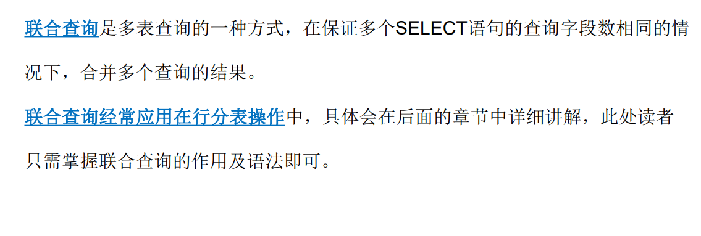

# 多表操作

## 1.多表查询

### 1.联合查询(select语句组合)

### 2.连接查询(难点:涉及笛卡尔积)

## 2.子查询

### 1.什么是子查询(终于当一回人了)

### 2.子查询分类

**(怎么分类,话说,先搞清楚子查询是什么啊喂#`O′) )**

**我的情绪这么亢奋**,**有点危险的说**

#### 标量子查询

子查询返回结果是一个数据,即一行一列(一行+一列的意思,不是一行对应一列)

~~~mysql
WHERE 条件判断 {=|<>} (SELECT 字段名 FROM 数据源）[Where] [GROUP BY]PB[ORDER BY] [HAVING] [ORDER BY][LIMIT]);
~~~

#### 列子查询(难一点)

子查询返回结果是一个字段符合条件的所有数据, 即一列多行

#### 表子查询(很难)

子查询的返回结果用于from数据源, 他是一个符合二维表结构的数据, 可以是一行一列,一列多行,一行多列,或者多行多列

### 3.子查询关键字(记忆就完了)

## 3.外键约束(重点,上课再仔细听)

### 1.添加外键约束

### 2.关联表操作

