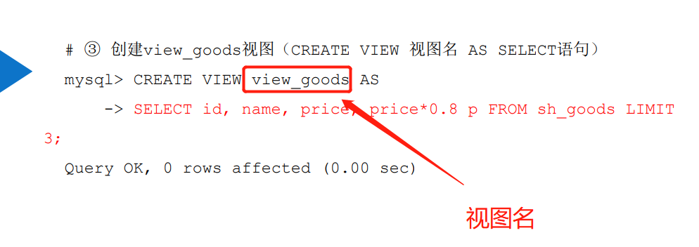

# 视图

## 0.目标:

### 1.了解视图的概念和作用

### 2.掌握视图的创建,查看,修改和删除操作

### 3.掌握视图的数据操作

## 1.初识视图

### 1.视图的概念和使用

概念:是从一个或者多个表中导出来的表, 它是一中虚拟存在的表,表的结构和数据都依赖于基本表

例子:

作用:

- 简化查询语句:简化用户的查询操作, 使查询更加便捷
- 安全性: 更方便的进行权限控制
- 逻辑数据独立性:屏蔽真实表结构变化带来的影响

### 2.创建视图的语法格式(important)

create: 表示创建视图的关键字 or replace: 可选,表示替换已有视图**(创建视图,或者替代原有视图)**

algorithm: 可选,表示视图算法,会影响查询语句的解析方式

definer:可选,表示定义视图的用户, 与安全控制有关,默认为当前用户

sql security:可选,用于视图的安全控制(important)

view_name: 表示要创建的视图名称

column_list: 可选,用于指定视图的各个列的名称

as: 表示视图要执行操作

select_statement: 一个完整的查询语句,表示从某些表或视图中查出某些满足条件的记录,将这些记录导入视图中.**(子查询)?**

with check option: 可选,用于试图数据操作时的检查条件,若省略此子句,则不进行检查.

## 2.视图管理

### 1.创建视图

### 2.查看视图

### 3.修改视图

### 4.删除视图

## 3.视(试)图数据操作

### 1.添加数据

### 2.修改数据

### 3.删除数据

### 4.视图检查条件

