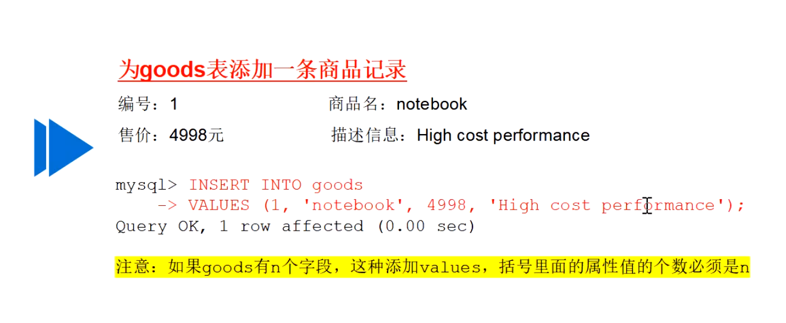

# 数据库基本操作

- DBMS: 数据库(Database)管理(Manage)系统(System)
- DB: 数据库
- data: 数据

- 数据库管理系统操作数据库
  - 数据库操作数据表
    - 数据表操作数据

## 数据库操作

### 创建数据库

- 语句
  - 直接创建 create database mydb;
  - 防报错 create database **if not exist** mydb;
    - 查看报错 show warnings;

### 查看数据库

- 语句

  - 查看所有数据库: show databases;

  - 查看指定数据库的创建信息: show **create** database **数据库名称**;

  - 两种方式展示数据库信息区别

    ~~~mysql
    1:
    2:
    ~~~

    

- 初始数据库信息

  - information_schema: 数据字典
  - perfoemance_shcema: 性能字典
  - mysql: 控制和管理信息
  - sys: 系统数据库
  - 示例

### 选择数据库

- 语句:
  - use 数据库名称;
  - 登陆时直接进入数据库
    - 密码显示
      - mysql -u 用户名 -p 密码 数据库名;
    - 密码隐藏
      - mysql -u 用户名 -p 数据库名;

### 删除数据库

- 语句:
  - drop database mydb;(不存在即报错)
  - drop database if exists mydb;(不存在数据库则跳过)

### 查看数据库设计(特定)

- 查看该数据库配置文件

  ~~~java
  ~/data/数据库名称/db.opt文件
  ~~~

- mysql命令行

  ~~~mysql
  show create database 数据库名称;
  ~~~

  

~~~mysql
# 查看数据库 
create database 数据库名称 [库选项]
/*
数据库,库选项用于设置数据库相关特性,如字符集CHARSET
*/
# 查看数据库 
show databases;
# 选择数据库 
use 数据库名称;
# 删除数据库 
drop database 数据库名称;
~~~

## 数据表操作

### 1. 创建数据表

- 语句

  - ~~~mysql
    CREATE [TEMPORARY] TABLE [IF NOT EXISTS] 表名
    (字段名 字段类型[字段属性]...)[表选项]
    ~~~

- 例子

  **数据库表创建设置编码格式**
  
  
  
- 说明

  - 字段名:
  - 字段类型: 字段中保存数据类型
  - TEMPORARY: **可加**,表示创建表为临时表,之后就删了
  - 字段属性: 可选,字段的某些特殊约束条件
  - 表选项: 可选, 用于设置表的相关特性, 如 存储引擎(EGINE),字符设置(CHARSET)

- 创造要点

  - 数据表的名称, 一般选用数据库的前几个字母作为前缀
  - 创建数据库表时, 要选择数据库
  - 选择数据库时, 可使用"USE数据库" or "数据库.表名"

### 2. 查看数据表

- 返回数据表名

- 语句

  - 省略匹配模式

    ~~~mysql
    show tables 查看数据表
    show table status 查看数据表的状态信息
    ~~~

  - Like 匹配模式

    ~~~mysql
    show tables [like 匹配模式]
    show table status [like 匹配模式]
    /* 
    省略可选项，表示查看当前数据库中的所有数据表。
    添加可选项，则按照“匹配模式”查看数据表。
    匹配模式符 “%” 匹配一个或多个字符，代表任意长度的字符串。
    匹配模式符"_"仅可以匹配一个字符。
    */
    SHOW TABLES LIKE '%new%' # 查看名称中含有new的数据表
    ~~~

  - From匹配模式

    ~~~mysql
    show tables [from 数据表名]
    show table status [from 数据表名]
    SHOW TABLE STATUS FROM mydb LIKE '%new%'\G # \g表示分号(;)
    ~~~

  
  ## 这是啥?
  
  

### 3. 修改数据表

- 修改数据表名,数据表选项,**选项≠数据表结构**,结构指的是各个字段,选项指的是整个表的设置

- 示例:

- 语句

  - 修改数据表名称

    ~~~mysql
    # 语法格式1
    ALTER TABLE 旧表名 RENAME [TO|AS] 新表名;
    # 语法格式2
    RENAME TABLE 旧表名1 TO 新表名1[, 旧表名2 TO 新表名2] ...;
    #例子
    rename table mysql yoursql #省略to
    ~~~

  - 修改数据表选项

    ~~~mysql
    ALTER TABLE 表名 表选项 [=] 值;
    表选项: 字符集, 存储引擎和校对集..
    # 例子
    # 改变表的字符集
    alter table yoursql charset = utf-8;
    # 查看修改结果
    show create table my_goods \g
    ~~~

    

- 结果

  

### 4. 查看表结构

- 查看表字段名(field),字段数据类型(type),允许为空(null)

- descrobe 语句

  ~~~mysql
  # 语法格式1：查看所有字段的信息
  { DESCRIBE | DESC } 数据表名;
  # 语法格式2：查看指定字段的信息
  { DESCRIBE | DESC } 数据表名 字段名;
  /*
   DESCRIBE语句以简写成DESC。
   DESC可以查看数据表的字段信息也可以查看指定字段的信息。
  */
  ~~~

  - 结果

- show 语句

  ~~~mysql
  # 语法格式1
  SHOW [FULL] COLUMNS FROM # 数据表名 [FROM 数据库名];
  # 语法格式2
  SHOW [FULL] COLUMNS FROM # 数据库名.数据表名;
  /*
   省略可选项FULL，查询结果与DESC语法相同。
   添加可选项FULL，可额外查看字段权限、COMMENT字段注释等。
   上述语法中，数据表名 FROM 数据库名与数据库名.数据表名等价。
   */
  
  ~~~
  
  - 结果
  
- 

  ~~~mysql
  SHOW CREATE TABLE 表名;
  /*
   可查看到创建数据表的具体SQL语句。
   可查看到数据表的字符编码。
   Table表示查询的表名称。
   Create Table表示创建该数据表的SQL语句。
  */
  ~~~

  

### 5. 修改表结构

#### 5.1修改字段名

~~~mysql
ALTER TABLE 数据表名 
CHANGE [COLUMN] 旧字段名 新字段名 字段类型 [字段属性]
# 例子
alter table yoursql 
change description des mysql varchar(255);
~~~

#### 5.2修改字段类型

~~~mysql
ALTER TABLE 数据表名
MODIFY [COLUMN] 字段名 新类型 [字段属性];
# 例子
alter table mysql modify des char(255);
alter table t1 modify b int not null
#  在MySQL中仅修改数据表中的字段类型，通常使用MODIFY实现。
~~~

#### 5.3修改字段位置

~~~mysql
ALTER TABLE 数据表名
MODIFY [COLUMN] 字段名1 数据类型 [字段属性] [FIRST | AFTER 字段名2];
/*
 FIRST：表示将字段名1调整为数据表的第1个字段。
 AFTER 字段名2：表示将字段名1插入到字段名2的后面
*/
# 例子
alter table mysql modify des char(255) after name;
~~~

#### 5.4新增字段

~~~mysql
# 语法格式1：新增一个字段，并可指定其位置
ALTER TABLE 数据表名
ADD [COLUMN] 新字段名 字段类型 [FIRST | AFTER 字段名];
# 语法格式2：同时新增多个字段
ALTER TABLE 数据表名
ADD [COLUMN] (新字段名1 字段类型1, 新字段名2 字段类型2, ...);
# 在不指定位置的情况下，新增的字段默认添加到表的最后。
# 新增多个字段时不能指定字段的位置
# 例子
alter table mysql add num int after name;
~~~

#### 5.5删除字段

~~~mysql
ALTER TABLE 数据表名 DROP [COLUMN] 字段名;
# 删除字段指的是将某个字段从数据表中删除
# 例子
alter table mysql drop num;
~~~

### 6. 删除数据表

~~~mysql
DROP [TEMPORARY] TABLE [IF EXISTS] 数据表1 [, 数据表2] …;
# 删除数据表操作指的是删除指定数据库中已经存在的表。
# 在删除数据表的同时，存储在数据表中的数据都将被删除。
# 同时删除多个数据表时，多个数据表之间使用逗号分隔。
# 可选项IF EXISTS用于在删除一个不存在的数据表时，防止产生错误。

~~~

**删除字段**

## 数据操作

### 1.添加数据

~~~mysql
INSERT [INTO] 数据表名 [字段名1...] {VALUES | VALUE}(值1[, 值2] …);
# 没加字段名默认添加全部字段
~~~

#### 1.1所有字段

~~~mysql
INSERT [INTO] 数据表名 {VALUES | VALUE}(值1[, 值2] …);
p 严格按照数据表结构（字段的位置）插入对应的值。
p 值列表“值1 [,值2] …”中多个值之间使用逗号分隔。

~~~

#### 1.2指定字段

~~~mysql
# 语法格式1
INSERT [INTO] 数据表名 (字段名1 [, 字段名2] …)
{VALUES | VALUE} (值1[, 值2] …);
# 语法格式2
INSERT [INTO] 数据表名 SET 字段名1 = 值1 [, 字段名2 = 值2]...;
# 字段名必须与数据相对应。
# INSERT INTO]… SET 一次仅能添加一条记录。
# 例子
insert mysql (name, num) value ("wang",6);
insert mysql set name="wang",num=6;
~~~

#### 1.3多行数据

~~~mysql
INSERT [INTO] 数据表名 [(字段列表)]
{VALUES | VALUE} (值列表) [, (值列表)] …;
# 多个值列表之间使用逗号（,）分割。
# 省略字段列表时，插入数据需严格按照数据表创建的顺序插入。
# 添加字段列表时，值列表插入的数据仅需与字段列表中的字段
# 相对应即可
# 例子:
insert mysql (name, num) value ("wang",6),
("li",4),
("zhang",5);
~~~

***注意*: 在多数据插入时，若一条数据插入失败，则整个插入语句都会失败**

### 2.查询数据

#### 2.1 全部数据

~~~mysql
select * from 数据表名(数据库.数据表);
select * from mysql(mysql.mysql)
~~~

#### 2.2 部分字段数据

~~~mysql
select {字段名1,字段名2, 字段名3,...} from 数据表名;
select id,name,sex from mysql;
~~~

#### 2.2 符合条件数据

~~~mysql
select {字段名1,字段名2, 字段名3,...} from 数据表名 where 字段名1=1;
select id,name,sex from mysql where sex="male";
~~~

### 3.修改数据

#### 3.1说明:总体语句结构跟select一样,没什么好说的

~~~mysql
UPDATE 数据表名
SET 字段名1 = 值1 [, 字段名2 = 值2, …] [WHERE 条件表达式];
p 有WHERE条件，修改符合要求的对应字段。
p 无WHERE条件，修改表中所有对应的字段。因此读者在修改数
据时，请谨慎操作
~~~

### 4.删除数据

~~~mysql
DELETE FROM 数据表名 [WHERE 条件表达式];
# 有WHERE条件，删除满足条件的记录
# 无WHERE条件，系统就会自动删除该表中所有的记录，因此读
# 者在操作时需要慎重
~~~

## show操作

1.show 数据库

~~~mysql
show create database mysql; #查看创建该库时,所用语句
~~~

2.show 数据表

~~~mysql
show create table user; #查看创建该表时,所用语句,所得信息
SHOW TABLE STATUS FROM mydb LIKE '%new%'\G # \g表示分号(;) //查看满足条件的数据表状态
~~~

3.show 数据字段

~~~mysql
show  full columns from user;//查看报表的所有字段信息
~~~

## 作业启发

1. MySQL的**()**只用子多个相关数据下

   ~~~mysql
   select (id,name) from shop where (id=2 or name="father")#错的
   select id, name form shop where id=2 or name="father" #已改正
   
   /*
   正统用()的爷在下面
   */
    CREATE TABLE `my_goods` (
     `id` int DEFAULT NULL COMMENT '编号',
     `name` varchar(32) DEFAULT NULL COMMENT '商品号',
     `price` int DEFAULT NULL COMMENT '价格',
     `description` varchar(255) DEFAULT NULL COMMENT '商品描述'
   ) ENGINE=InnoDB DEFAULT CHARSET=utf8mb3 |
   
   ~~~

   2.mysql的**''**只用在字符串/字符下,字段名/数据库名/数据表名 等 关键字用不上;

   ~~~mysql
   mysql> create database if not exists "mydb" character set utf8;(❌)
   mysql> create database if not exists mydb character set utf8;(✔)
   
   ~~~

   3. 设置(初始化)字符编码不分数据库/表(光标位置),皆为

   ~~~mysql
   mysql> create database if not exists mydb character set utf8;# 原结论
   # 改变表的字符集
   alter table yoursql charset = utf-8;# 反例了属于
   ~~~

   4. 文件编码方式

   ~~~mysql
   怎么说呢, 数据库配置文件(xxx.opt)没找到
   找到了数据表配置文件(xxx.ibd),用vscode打开发现其为二进制代码,那xx.opt也应该是把,话说,真不是看官方文档就知道的事吗?为什么我要在这傻推?
   ~~~

   

