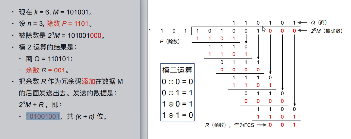

# 数据链路层

## 数据链路层概述

### 信道类型

## 三个基本功能

### 封装成帧

### 透明传输(数据部分与帧的首尾相同)

### 差错检测(汉明码可以看看)

CRC冗余码的计算(为0没有出错,不为0出错)

将结果作为FCS

### CRC检测方法(检测不对就丢弃,需要重传(tcp))

# 数据链路层

## 点对点协议ppp

## ppp协议要点

## ppp协议的基本要求

## ppp协议的组成

## ppp帧格式

## ppp透明传输

字符填充解决透明传输问题

## 可靠传输问题

## ppp工作状态

w