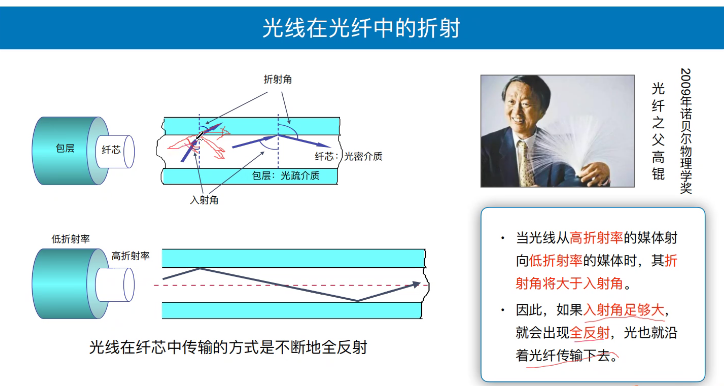
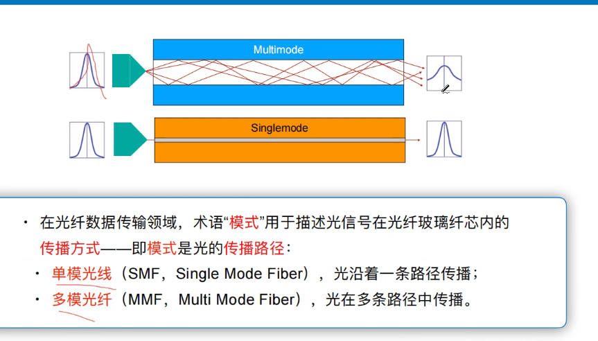
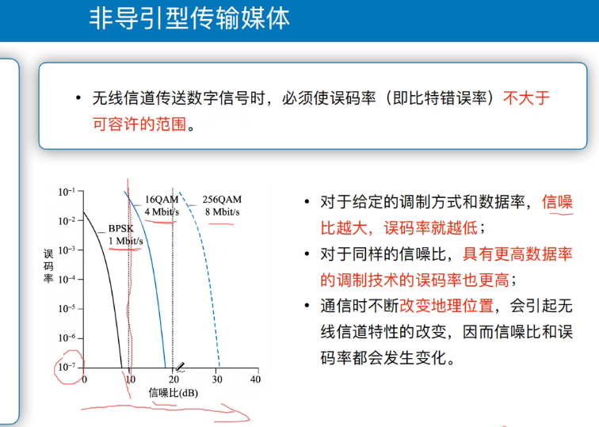
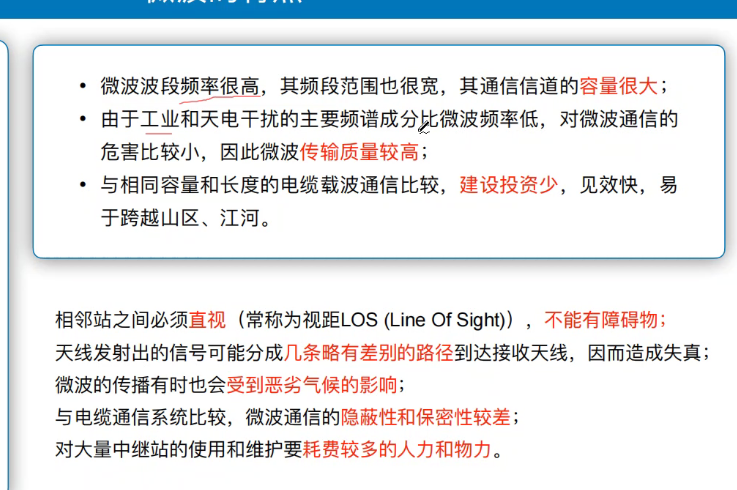
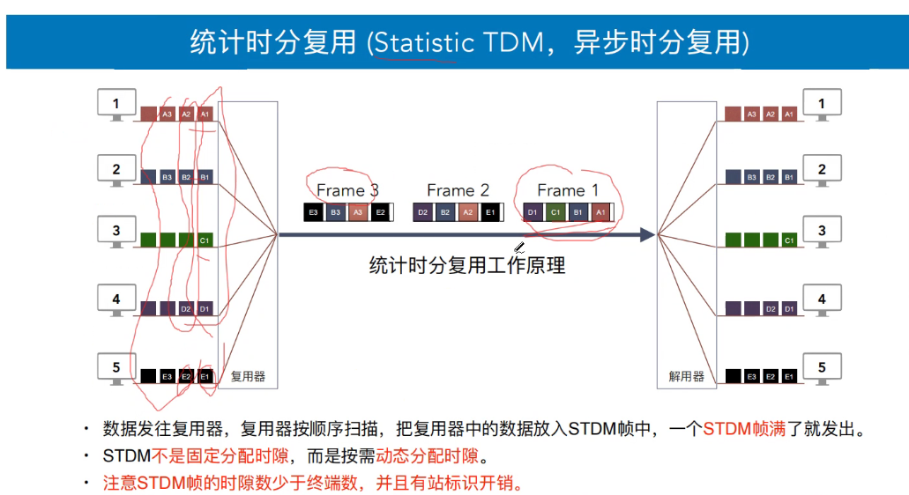
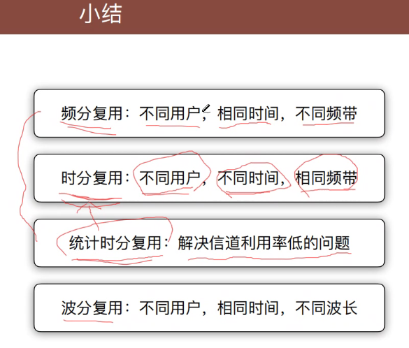
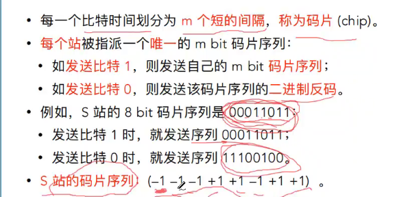
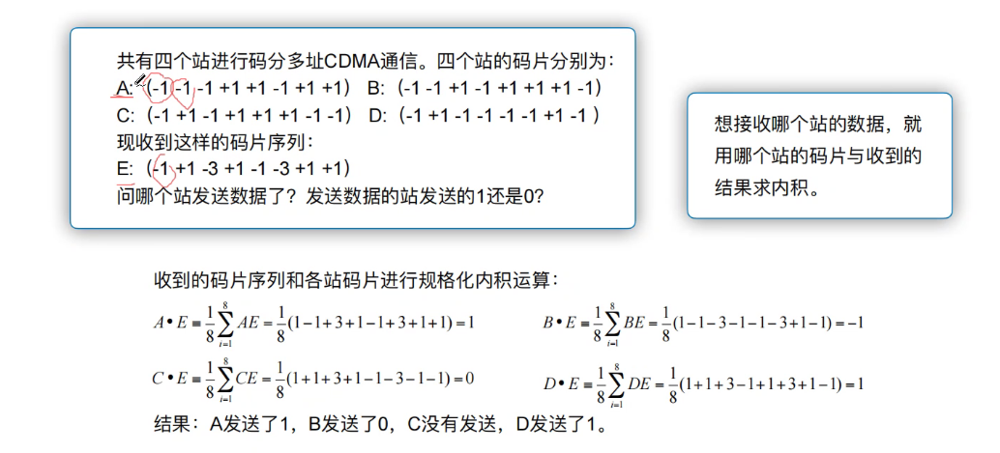
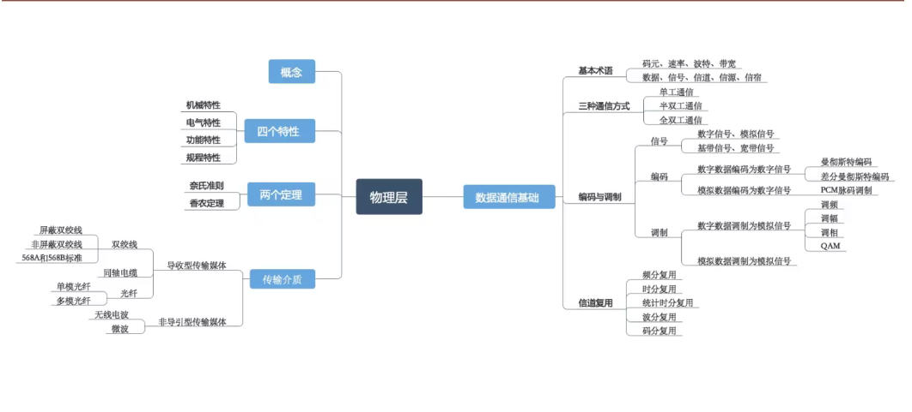

# 物理层

## 基本概念

我们学习的**物理层不包含物理媒介,**而是确定与传输媒体的**接口特性**

### 我们学习什么?

- 计算机间的通路是什么?

- 数据是如何传输的?
- 数据传输速率是多少?

### 物理层接口特性

- 机械特性: 	接口所用接线器的一些物理属性如接口形状,接口尺寸,引线数目及其排列
- 电气特性:     接口电缆的各条线上出现的**电压**的范围,阻抗匹配,传输速率,距离等;
- **我的存在是让你记住上面那个电压**
- 功能特性: 某条线上出现的某条电平的电压的意义,接口部件信号线的用途
- 过程特性: 对于不同功能的各种可能事件的出现顺序, 定义各条物理线路的工作流程和时序关系.

### 信号类型

- 铜缆:基于电平(electrical signals)
  - 电平与电压什么关系?
  - 电平:两功率(电压)之比的对数,**单位:db**
  - 
- 光纤: 基于光脉冲(light pluse)
- 无线: 基于微波 (Microwave)

### 标准的制定(不重要)

## 功能

主要功能:

解决计算机间比特传输问题,**透明地**传送比特流(比特流怎么产生是计组内容),关心的是**点到点的问题**

- **透明传输**:指的是不管所传输的数据是什么样的比特组合,都能够在链路上传输
- 要尽可能地屏蔽掉不同传输媒体和通信手段的差异.

## 常用物理层标准

**(不重要,助于物理层理解)**

### **RJ45是什么?**

### RJ45视图

### RJ45机械特性

**(不涉及具体设备,只是了解其特性)**

- 接线顺序标准
  - 568B: 橙白, 橙, 绿白, 蓝, 蓝白, 绿, 棕白, 棕 (8根线)
  - 568A:...
- 卡接簧片表面镀金或者镀银,可接线径为0.4mm~0.6mm
- 插头插座可重复插拔次数不小于750次;8线接触镀金509(inch)

### RJ45电气特性

- 额定电流:1.5MPS;
- 额定电压:125VAC
- 绝缘电阻:不小于500MΩ,工作环境温度(影响电阻):-40℃-85℃
- 耐压强度: AC 1000V 50Hz或者60HZ; 1分钟接触电阻: 不大于20MΩ;

### RJ45功能特性

- 差分信号: 两根线都发送数据, 振幅相同, 相位相反;

- 两根线的**电势差小于1.6V**即可认为"0",两根线的**电势差大于8V**,就可确认为"1"

  - 初中补课:

    

每一个元器件都有其功能

## 数据通信基础

### 数据通信模型

### 基本术语(对通信模型说明)

- 信息:消息是客观物质运动或主观思维活动，以及事件发生状态的一种反映(**在键盘敲出:"你好")**
- 数据:运送消息的实体.消息在传输之气需要编码,编码后的消息就变成了数据(将消息存储到计算机中形成二进制比特流)(**"你好"被转换为二进制比特流)**
- 信号: 数据的电气的或电磁的表现.数据在通信线路上传递需要变成电信号,or光信号("二进制比特流被猫(已被路由器集成)*<u>调制</u>*为模拟信号")

- 模拟信号: 波形

- 数字信号: 0/1

- 信源:产生和发送数据的源头

- 信宿:接受数据的终点

- 信道:信号传输的通道(传输媒介), 一般来表示向某一个方向传送消息的额介质,一端是发送消道,另一端是接受信道.**一条传输介质上可以有多条信道**

  **(信道:在这里信号会被干扰,为了信号不失真,我们可以让信号特点更明显,或者改进信道.)**

三种通信方式

单向(单工)通信:只有单方向通信,没有反方向的交互(udp,电视机,广播)

双向交替(半双工)通信: 通信双方,可以互发数据,但不能同时发送和接收(对讲机)

双向同时通信: (电话)

基带信号: 没有经过调整的信号(易损失)

模拟基带信号:通话

数字基带信号:计算机

基带传输:数字信道上

### 信号的调制与编码

#### 宽带传输优点

#### 概念:调制与编码

- 调制:转成模拟信号

- 编码:转成数字信号

- - 

#### 编码方式

**(数字信号0/1->电压0/1)** <u>*记清楚从什么转换成什么*</u>

- 非归零编码: 正电平代表1,负电平代表0.

- 归零编码: 正脉冲代表1,负脉冲代表0

- 曼彻斯特编码: 电压从高到低跳变表示"1",从低到高跳变表示"0",但也可反过来定义

- 差分曼彻斯特编码: 在每一位的中心处始终都有跳变.位开始边界有跳变代表0,而位开始边界没有跳变代表1

  

曼彻斯特编码:看每个0/1的中间,载波从高往低跳, 数字信号为1.

差分曼彻斯特编码: 看每个0/1的中间,载波跳动方式不变,则表示数字信号0.

#### 调制方式

**数字信号(0/1->载波)记清楚转换成什么**

**这里只涉及带通调制**

- 带通(载波调制)调制是什么?

  - 将计算机产生的数字信号<u>(二进制比特流)</u>转换为(路由器)模拟信号<u>(载波)</u>的过程

- 为什么要带通调制?

  - 电压可携带更多信息,为什么不呢?(1v,2v,3v,4v,5v)

  - 网络通信是远距离的,需要使用宽带传输.且宽带传输相比基带传输可以带更多信息(音频,视频,数字信号)

  - 宽带传输

    

- 怎么带通调制

  - 基本带通调制方法(调出的载波需要区分0 1(至少))

    

- 为什么是带通调制

  - 问题重述: 在宽带传输中为什么是带通调制? 即为什么信道为什么要用载波?
  - 答案:网络通信介质是铜,导电.光缆导光,而两者都是波形.

### 码元

#### 作用位置:(载波->宽带传输)

**信源发送端将数字信号转换为模拟信号,丢进宽带传输的数据**

2进制只能携带一个比特,4进制携带两个比特,8进制携带4各比特(码元:固定时长)

#### **例子**

### 概念关系图

## 信道

### 信道的极限容量

- 概念:

保障信号不失真的最大信息容量(信道)

- 码元传输速率高,容易导致码间串扰
  - 解释: 传输速率高=频率高,频率高=单位时间内变化次数高,若传入的码元单位时间变化次数过高,信道带宽不够高(带宽的频率最高值<码元频率),无法分辨出每个码元,就导致了码间串扰.

### 信道带宽:频率范围

#### 举例:

- 一个信道可以运送1hz的频率,那么他的信道带宽就是1
- 一个信道可以运送2000hz的频率,那么他的信道带宽也为1
- 一个信道可以运送1hz和20hz的频率,那么他的信道带宽为2.

**信号的带宽**:**信号所包含的各种不同频率成分所占据的频率范围**

### 奈奎斯特定理:

- 条件:无噪声,带宽受限(w受限==有具体数值)
- 目的:算出避免码间串扰的最大数据传输率

考虑进制影响,根据带宽,进制算最大数据传输率

#### 公式讲解

码元:电压不等于HZ;

HZ=表示电压(载波)变化频率,而电压表示载波上的每个数字. 码元则是载波上的数字,即电压.

信道带宽:信道可以传输的电压(载波)变化频率范围

信号带宽:信号所包含的电压(载波)变化频率范围

### 香农:根据信噪比,带宽算传输速率

#### 信噪比

传输速率低于香农极限传输速率,不失真

#### 例子

### 以谁为准?

谁小以谁为准,谁小谁所考虑因素,占主导作用.

# 物理层

## 传输媒体分类

## 电磁波频谱

## 双绞线(3 5)

## 同轴电缆

## 光纤

- 单模光纤

- 多模光纤

  

- 光线波长

## 小结

## 非导引型传输媒体

- 误码率

- 微波
- 

- 微波接力

- 卫星通信

- 无人机(频谱要报备)
- 

## 小结

## 信道复用

- 频分多路复用(电视台,有多个频道)
- 时分多路复用(公交车),变慢(信道利用率不高,)隔一段时间采样,但有时候不满
  - 

- 统计时分复用(快递装车)

- 波分复用

- 码分复用

- 规格化内积

## 本章总结(考察计算量A)

