# 物理层

## 传输媒体分类

## 电磁波频谱

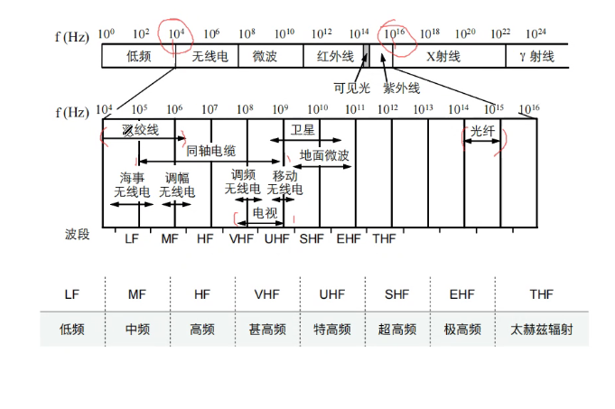

## 双绞线(3 5)

## 同轴电缆

## 光纤

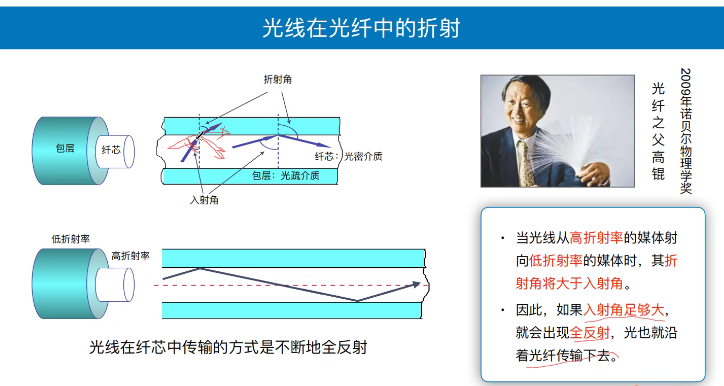

- 单模光纤

- 多模光纤

  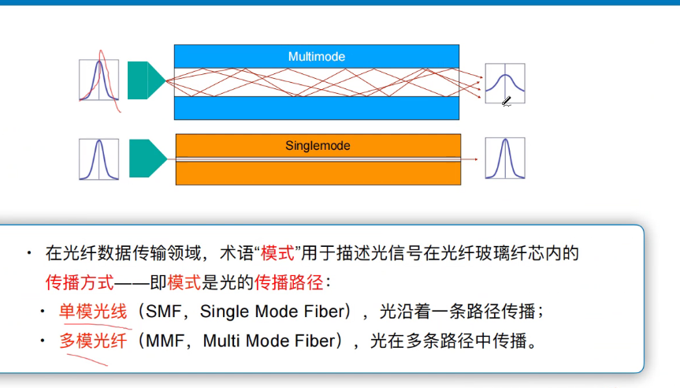

- 光线波长

## 小结

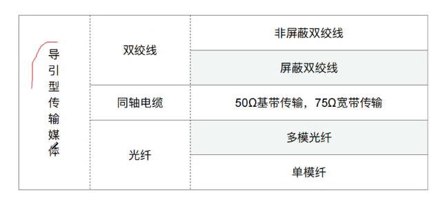

## 非导引型传输媒体

- 误码率

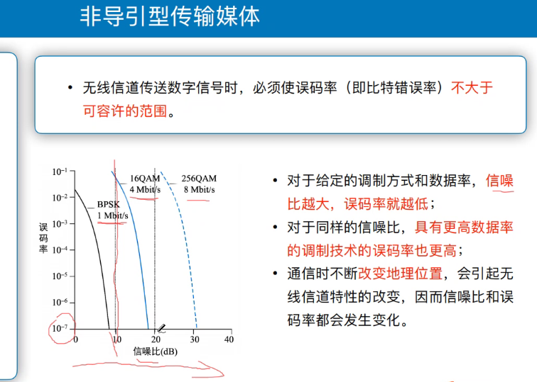

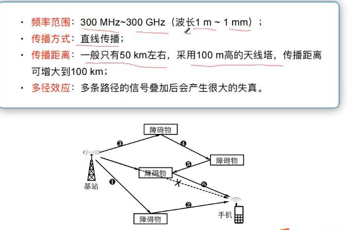

- 微波
- 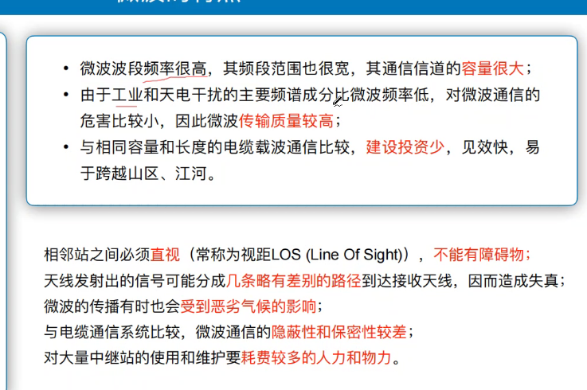

- 微波接力

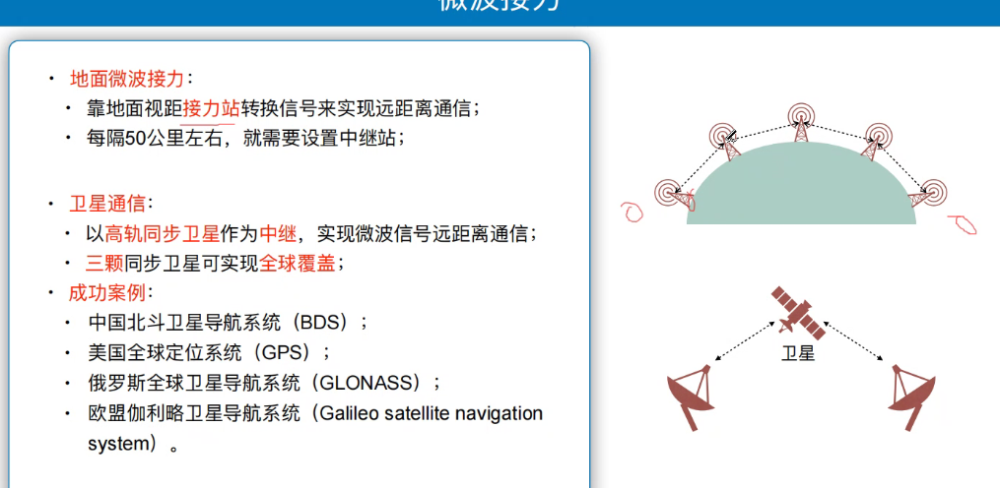

- 卫星通信

- 无人机(频谱要报备)
- 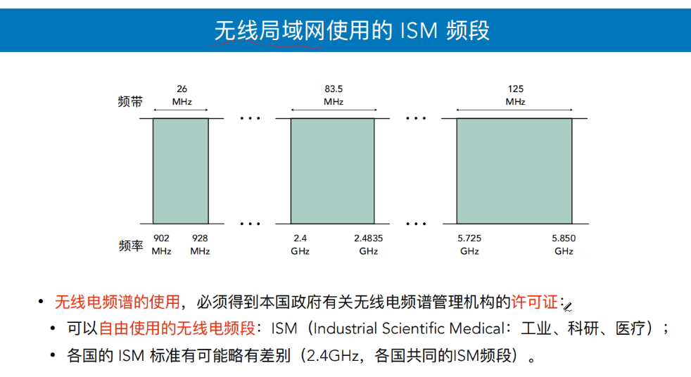

## 小结

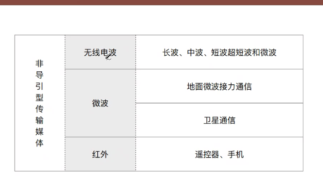

## 信道复用

- 频分多路复用(电视台,有多个频道)
- 时分多路复用(公交车),变慢(信道利用率不高,)隔一段时间采样,但有时候不满
  - 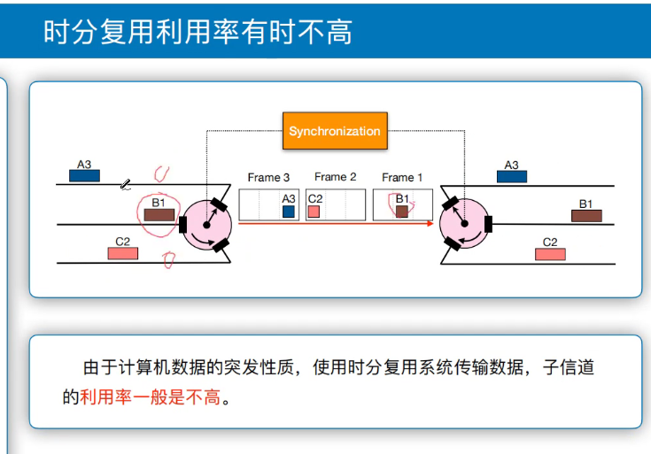

- 统计时分复用(快递装车)

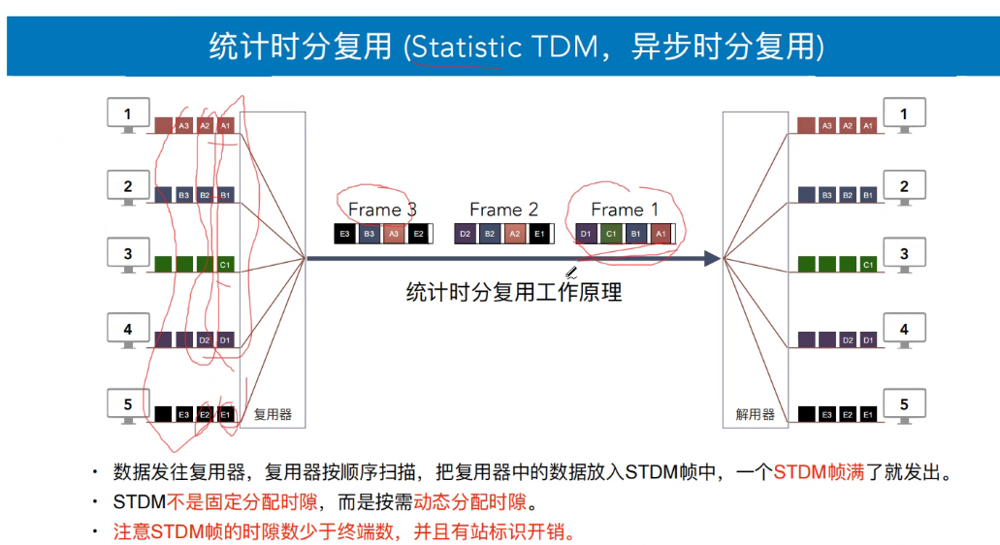

- 波分复用

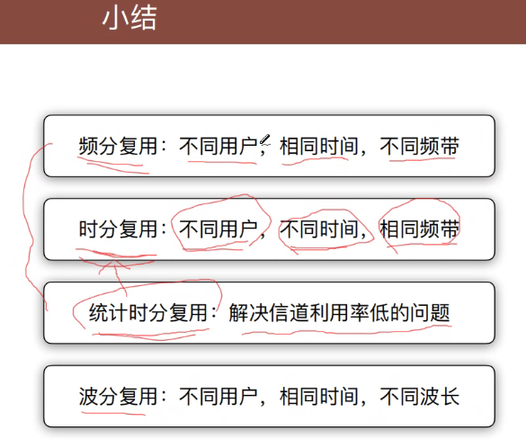

- 码分复用

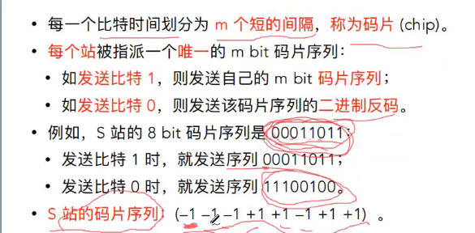

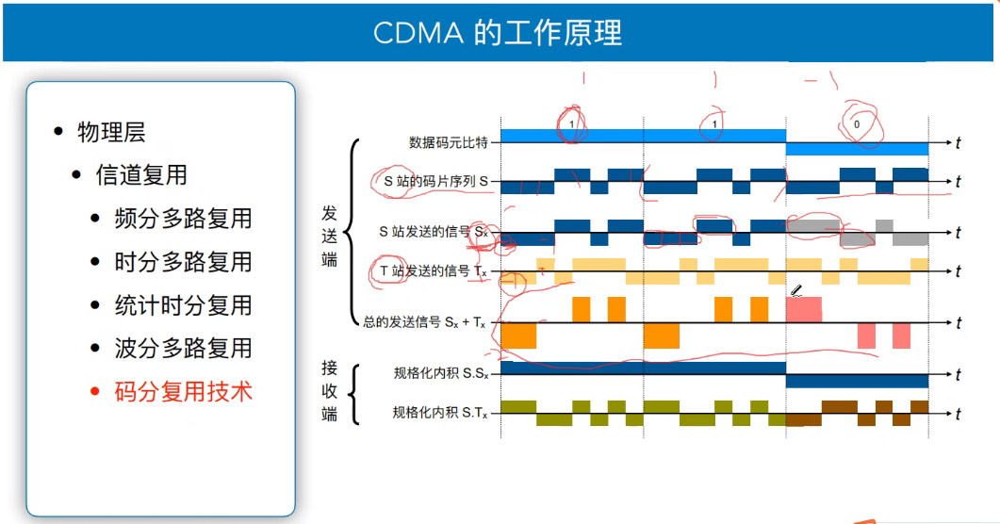

- 规格化内积

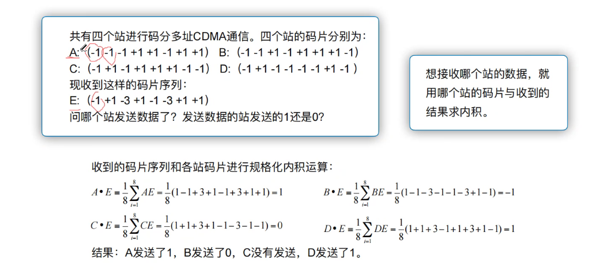

## 本章总结(考察计算量A)

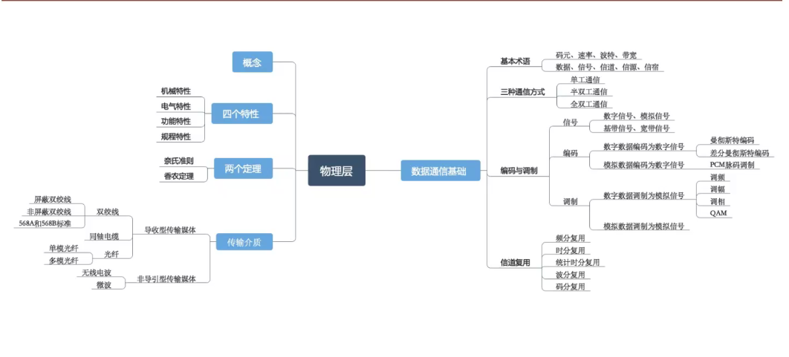